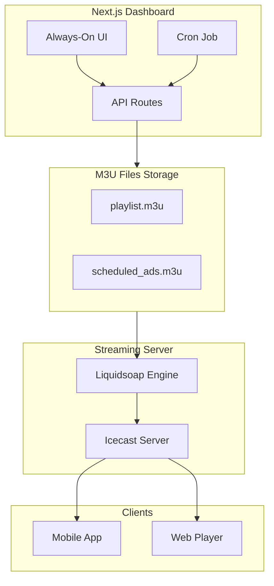

# خطة تنفيذ نظام البث العام المستمر (Always-On)

## الوضع الحالي

### ما هو مُنفذ بالفعل:

**قاعدة البيانات (100%):**

- جدول `radio_content` للمحتوى
- جدول `playlist_timeline` للجدولة
- جدول `playlist_logs` للسجلات
- `club_activities.broadcast_mode` للتبديل
- RPC functions وTriggers

**الواجهة الأمامية (100%):**

- `ContentLibrary.tsx` - رفع وإدارة المحتوى
- `TimelineEditor.tsx` - جدولة المحتوى
- `always-on/page.tsx` - لوحة التحكم الرئيسية

**الخدمات (80%):**

- `autoSwitchService.ts` - مُنفذ بالكامل
- `radioContentService.ts` - مُنفذ (ينقص حساب مدة الملف)
- `playlistTimelineService.ts` - مُنفذ بالكامل
- `playlistEngineService.ts` - جزئي (ينقص البث الفعلي)

### ما ينقص:

- **Playlist Engine Backend** - محرك البث الفعلي
- **M3U File Generation** - توليد ملفات القوائم
- **API Routes** - واجهات برمجية للتحديث
- **Liquidsoap Script** - سكريبت البث
- **Icecast Integration** - الاتصال بالسيرفر
- **Cron Job** - تحديث دوري للقوائم

---

## البنية المعمارية



---

## المرحلة 1: API Routes للتحديث (يوم 1-2)

### 1.1 إنشاء API Route لتوليد M3U

ملف جديد: [src/app/api/playlist-engine/generate-m3u/route.ts](src/app/api/playlist-engine/generate-m3u/route.ts)

```typescript
// يجلب المحتوى من playlist_timeline
// يولد محتوى M3U
// يحفظ في Supabase Storage أو يعيده كـ response
```

### 1.2 إنشاء API Route للإعلانات المجدولة

ملف جديد: [src/app/api/playlist-engine/scheduled-ads/route.ts](src/app/api/playlist-engine/scheduled-ads/route.ts)

```typescript
// يجلب الإعلانات المجدولة للوقت الحالي
// يولد M3U للإعلانات
```

### 1.3 إنشاء API Route للحالة

ملف جديد: [src/app/api/playlist-engine/status/route.ts](src/app/api/playlist-engine/status/route.ts)

```typescript
// يعيد حالة البث الحالية
// المحتوى الحالي والتالي
```

---

## المرحلة 2: Cron Job للتحديث (يوم 3)

### 2.1 Vercel Cron Configuration

تعديل: [vercel.json](vercel.json)

```json
{
  "crons": [{
    "path": "/api/playlist-engine/generate-m3u",
    "schedule": "* * * * *"
  }]
}
```

### 2.2 أو External Cron (بديل)

استخدام cron-job.org للاستدعاء كل دقيقة

---

## المرحلة 3: Liquidsoap Script (يوم 4-5)

### 3.1 إنشاء سكريبت Liquidsoap

ملف جديد على السيرفر: `/etc/liquidsoap/radio_karmesh.liq`

```liquidsoap
#!/usr/bin/liquidsoap

# Live Input (للبث المباشر)
live = input.http("http://radio.karmesh.eg:8000/live")

# Always-On Playlist
playlist = playlist.safe(
  reload_mode="rounds",
  reload=1,
  "/var/radio/playlist.m3u"
)

# Scheduled Ads
ads = playlist.safe(
  reload_mode="rounds", 
  reload=1,
  "/var/radio/scheduled_ads.m3u"
)

# Fallback Logic: Live -> Ads -> Playlist
radio = fallback(track_sensitive=false, [live, ads, playlist])

# Crossfade
radio = crossfade(radio)

# Output to Icecast
output.icecast(
  %mp3(bitrate=128),
  host="localhost",
  port=8000,
  password="...",
  mount="/stream",
  radio
)
```

---

## المرحلة 4: تحديث الخدمات (يوم 6-7)

### 4.1 تحديث playlistEngineService

تعديل: [src/domains/club-zone/services/playlistEngineService.ts](src/domains/club-zone/services/playlistEngineService.ts)

- إضافة `generateM3UPlaylist()` - لتوليد محتوى M3U
- إضافة `uploadM3UFile()` - لرفع الملف
- تحديث `startEngine()` - لاستدعاء API Route

### 4.2 حساب مدة الملف

تعديل: [src/domains/club-zone/services/radioContentService.ts](src/domains/club-zone/services/radioContentService.ts)

استخدام Web Audio API أو مكتبة لحساب المدة

---

## المرحلة 5: Dashboard Integration (يوم 8-9)

### 5.1 إضافة Stream Output Manager

تعديل: [src/app/club-zone/radio/always-on/page.tsx](src/app/club-zone/radio/always-on/page.tsx)

- عرض رابط M3U الحالي
- زر اختبار الاتصال
- عرض إحصائيات البث

### 5.2 تحديث Now Playing

إضافة endpoint يقرأ من Icecast مباشرة:

ملف جديد: [src/app/api/radio/now-playing/route.ts](src/app/api/radio/now-playing/route.ts)

---

## المرحلة 6: Testing وIntegration (يوم 10-14)

### 6.1 اختبار المكونات

- رفع محتوى ← يظهر في M3U
- جدولة ← تتحدث قائمة التشغيل
- إعلانات ← تظهر في الوقت المحدد
- Live ↔ Always-On ← التبديل التلقائي

### 6.2 Mobile Integration

- `/api/radio/status` - حالة البث
- `/api/radio/now-playing` - المحتوى الحالي
- Stream URL: `http://radio.karmesh.eg:8000/stream`

---

## الملفات الجديدة المطلوبة

| الملف | الغرض |

|------|-------|

| `src/app/api/playlist-engine/generate-m3u/route.ts` | توليد M3U |

| `src/app/api/playlist-engine/scheduled-ads/route.ts` | إعلانات مجدولة |

| `src/app/api/playlist-engine/status/route.ts` | حالة البث |

| `src/app/api/radio/now-playing/route.ts` | المحتوى الحالي |

| `/etc/liquidsoap/radio_karmesh.liq` | سكريبت Liquidsoap |

| `vercel.json` | تعديل Cron |

---

## النتائج المتوقعة

### بعد المرحلة 1-2:

- API Routes تولد M3U files
- Cron يحدث كل دقيقة

### بعد المرحلة 3:

- Liquidsoap يبث من M3U files
- Icecast يخدم المستمعين

### بعد المرحلة 4-5:

- Dashboard يتحكم في البث
- حالة البث تُعرض بشكل حي

### بعد المرحلة 6:

- **بث مستمر 24/7**
- **إعلانات في أوقات محددة**
- **تبديل تلقائي Live ↔ Always-On**
- **Mobile يستقبل البث**
- **Dashboard يتحكم في كل شيء**

---

## متطلبات السيرفر

**VPS/Hetzner:**

- Icecast2 مثبت
- Liquidsoap مثبت
- مجلد `/var/radio/` للملفات
- Port 8000 مفتوح

**Vercel/Next.js:**

- Cron Jobs enabled
- Supabase Storage للملفات

---

## مخاطر وحلول

| المخاطر | الحل |

|--------|-----|

| تأخر Cron | استخدام خدمة خارجية كبديل |

| انقطاع الملفات | Fallback في Liquidsoap |

| حمل على DB | Cache للـ M3U content |