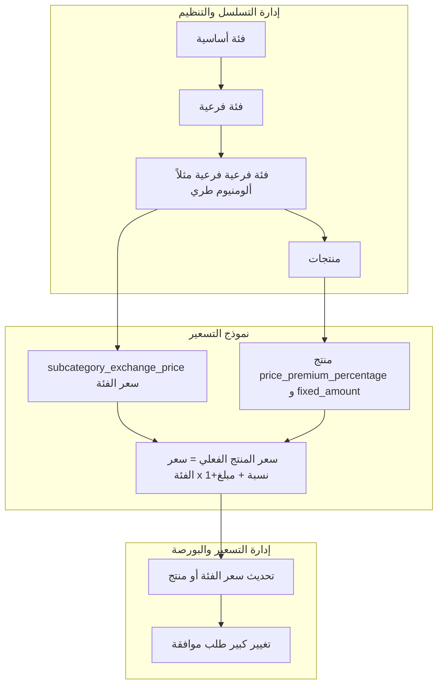

# خطة Workflow التسلسل والتسعير (مكتملة)

## تحليل البرومبت السابق والنتائج

من النقاش السابق وُجد ما يلي:

1. **الهرمية المطلوبة**: فئة رئيسية (معادن) → فئة فرعية (ألومنيوم) → فئة فرعية تحتية (ألومنيوم طري) → منتجات (كانزات، ألومنيوم شبابيك، أواني طهي، …). الفئة التي تحمل **سعر البورصة** هي مستوى "الفئة الفرعية" الأخير قبل المنتجات (مثل: ألومنيوم طري).
2. **نموذج التسعير**:
  - سعر البورصة = **سعر الفئة الفرعية** (مثلاً ألومنيوم طري = 100–110 ج/كجم) كسعر مرجعي.
  - كل منتج تحت هذه الفئة: إما نفس السعر، أو **أعلى** (كانزات: جودة أعلى)، أو **أقل** (أواني طهي: جودة أقل).
  - آلية موحدة: **نسبة مئوية** (زيادة/خصم) + **مبلغ إضافي اختياري** بالجنيه.
  - معادلة سعر الكيلو للمنتج: `سعر_كيلو_المنتج = سعر_بورصة_الفئة × (1 + نسبة_التعديل/100) + مبلغ_إضافي`.
3. **المنتجات بالقطعة**: (مثل الكانزات) تُوزن بالجرام، وتحويل للكيلو: (الوزن بالجرام / 1000) × سعر_كيلو_المنتج؛ النقاط بالقطعة مدعومة حالياً (`points_mode: per_piece`).
4. **التطبيق الحالي**: البورصة مرتبطة بكل **منتج** (`stock_exchange.product_id`)، وليس بفئة فرعية؛ لا يوجد حقل نسبة/مبلغ تعديل على المنتج. المزامنة من البورصة إلى المنتج في [sync_stock_exchange_to_waste_data_admin.sql](supabase/migrations/sync_stock_exchange_to_waste_data_admin.sql).

---

## الجزء الأول: نموذج التسعير (سعر الفئة + معدّل المنتج)

### 1.1 مصدر سعر البورصة للفئة الفرعية

- **قرار**: تخزين سعر البورصة **على مستوى الفئة الفرعية** (التي تُسعَّر تحتها المنتجات)، وليس فقط على مستوى المنتج.
- **تنفيذ مقترح**:
  - جدول جديد: `subcategory_exchange_price` (أو توسيع موجود إن وُجد):
    - `subcategory_id` (مرجع إلى الفئة الفرعية التي تحمل السعر — مثلاً `waste_sub_categories.id` أو `unified_sub_categories.id` حسب مصدر الحقيقة).
    - `buy_price` (سعر الشراء للكيلو)، `sell_price` اختياري، `last_update`، `updated_by`.
  - أو: صفوف في `stock_exchange` بدون منتج (`product_id` = NULL) مع ربط بـ `subcategory_id` فقط لتمثيل "سعر الفئة". يلزم تعديل schema لـ `stock_exchange` لدعم `product_id` NULL وضمان وجود `subcategory_id`.
- **التوصية**: جدول مستقل `subcategory_exchange_price` أوضح للاستعلامات ولتفريق "سعر الفئة" عن "سعر منتج محدد".

### 1.2 معدّل السعر على مستوى المنتج

- **الحقول المطلوبة** (على جدول المنتج، مثلاً `waste_data_admin`، أو جدول إعدادات منتج مرتبط):
  - `price_premium_percentage` (NUMERIC): نسبة مئوية موجبة = زيادة، سالبة = خصم. افتراضي 0.
  - `price_premium_fixed_amount` (NUMERIC، اختياري): مبلغ ثابت بالجنيه يُضاف بعد النسبة. افتراضي 0 أو NULL.
- **المعادلة** (في الخدمة/التطبيق):
  - `سعر_كيلو_المنتج = سعر_بورصة_الفئة_الفرعية × (1 + price_premium_percentage/100) + COALESCE(price_premium_fixed_amount, 0)`.
- **مصدر سعر الفئة**: من `subcategory_exchange_price` (أو من صف البورصة للفئة) حسب الـ subcategory_id المرتبط بالمنتج.

### 1.3 ربط المنتج بالفئة الفرعية "السعريّة"

- المنتج (مثلاً `waste_data_admin`) له ربط بفئة فرعية (`subcategory_id` أو ما يعادلها). الفئة الفرعية التي تحمل السعر في البورصة قد تكون نفسها أو فئة أب في هرم (مثلاً ألومنيوم طري → ألومنيوم). يلزم تحديد "مصدر الحقيقة" لسعر البورصة:
  - إما أن تكون الفئة الفرعية المربوطة بالمنتج هي نفسها التي لها سطر في `subcategory_exchange_price`.
  - أو إضافة حقل "فئة التسعير" (مثل `pricing_subcategory_id`) إذا كان المنتج تحت فئة فرعية فرعية (sub-sub) والسعر المرجعي عند الأب.
- في الخطة: نعتبر أن **الفئة الفرعية المربوطة بالمنتج** هي التي لها سعر في البورصة؛ إن كان الهيكل "فئة فرعية فرعية" فإما نربط المنتج بأعلى مستوى يحمل السعر أو نضيف ربط تسعير صريح.

### 1.4 المنتجات بالقطعة والكيلو

- **بالكيلو**: سعر الكيلو = المعادلة أعلاه؛ النقاط حسب `points_mode: per_kg` (موجود في [points types](src/domains/financial-management/points/types.ts)).
- **بالقطعة**: وزن الوحدة بالجرام؛ سعر الوحدة = (الوزن_بالجرام / 1000) × سعر_كيلو_المنتج؛ النقاط حسب `points_mode: per_piece` و`points_per_piece`. لا تغيير في نموذج النقاط، بل مصدر "سعر الكيلو" يصبح المحسوب من الفئة + المعدّل.

### 1.5 المزامنة والعرض

- عند **تحديث سعر الفئة** في البورصة: تحديث `subcategory_exchange_price` (أو صف البورصة للفئة)؛ لا حاجة لتحديث كل المنتجات يدوياً لأن سعر المنتج يُحسب عند القراءة.
- عند **عرض البورصة**: إظهار سعر الفئة الفرعية (ألومنيوم طري)؛ وعند عرض منتجات يمكن إظهار "سعر الكيلو الفعلي" للمنتج (بعد تطبيق النسبة والمبلغ).
- **Trigger/خدمة**: إذا بقي جزء من التطبيق يعتمد على `stock_exchange` لكل منتج، يمكن الاحتفاظ بصف منتج "تمثيلي" أو تحديث سعر المنتج المحسوب في جدول المنتج عند تغيير سعر الفئة (حسب اختيار التصميم النهائي).

---

## الجزء الثاني: الهيكل والمنتجات في إدارة التسلسل والتنظيم

### 2.1 الهرمية

- **الحالي**: [OrganizationStructurePage](src/domains/warehouse-management/pages/OrganizationStructurePage.tsx): قطاعات → تصنيفات → فئات أساسية → فئات فرعية. [unified_sub_categories](src/migrations/unified_categories_system.sql) يدعم `parent_id` (فئة فرعية تحت فئة فرعية).
- **المطلوب**: دعم عرض مستوى "فئة فرعية فرعية" (مثل ألومنيوم طري تحت ألومنيوم) إن وُجد، ثم **المنتجات** تحت أدنى فئة فرعية.
- **تنفيذ**: في واجهة التسلسل الهرمي، عند اختيار فئة فرعية (أو فرعية فرعية): جلب المنتجات المرتبطة (من `waste_data_admin` أو ما يعادل حسب الربط). زر "إضافة منتج جديد" يفتح النموذج مع تحديد الفئة الحالية.

### 2.2 إنشاء منتج بسعر افتتاحي

- **خدمة**: `createProductWithOpeningPrice` (في خدمة موحدة للمخلفات أو [unifiedCategoriesService](src/domains/warehouse-management/services/unifiedCategoriesService.ts)):
  - المدخلات: معرف الفئة الفرعية (الأدنى في الهرم)، اسم المنتج، اسم عربي، وصف، سعر افتتاحي (ج/كجم)، صورة اختيارية، **نسبة تعديل** (افتراضي 0)، **مبلغ إضافي** (اختياري)، طريقة الحساب (per_kg / per_piece)، وزن الوحدة بالجرام إن كان بالقطعة.
  - المنطق:
    1. إنشاء/ربط سعر البورصة للفئة الفرعية إن لم يكن موجوداً (إدراج في `subcategory_exchange_price` بقيمة السعر الافتتاحي أو استخدامه كأول سعر للفئة).
    2. إدراج منتج في `waste_data_admin` (أو الجدول المعتمد) مع ربط الفئة الفرعية، و`price_premium_percentage` و`price_premium_fixed_amount`.
    3. إذا كان النظام لا يزال يعتمد على `stock_exchange` لكل منتج: إدراج صف في `stock_exchange` لسعر المنتج المحسوب (أو تمثيلي) وربط بـ `exchange_price_history` كـ "سعر افتتاحي".
  - المخرجات: تأكيد وإنشاء المنتج مع ملاحظة أن التحديثات اللاحقة من صفحة التسعير.

### 2.3 صفحة "إدارة الفئات والمنتجات"

- **الغرض**: عرض وإدارة تشغيلية (إظهار/إخفاء، ترتيب، تفعيل/تعطيل، أشكال/وحدات) دون إنشاء منتجات جديدة.
- **المحتوى**: جدول منتجات (الاسم، الفئة، السعر الفعلي للكيلو، مصدر السعر "من الفئة + نسبة/مبلغ"، الحالة، الإظهار في التطبيقات). عند اختيار منتج: تعديل `visible_to_client_app`، `visible_to_agent_app`، `display_order`، ونسبة/مبلغ التعديل السعري، وإدارة الأشكال/الوحدات إن وُجدت.
- **ترتيب العرض**: إضافة عمود `display_order` لجدول المنتجات (مثلاً `waste_data_admin`) إن لم يكن موجوداً.

---

## الجزء الثالث: إدارة التسعير والبورصة اليومية

### 3.1 تحديث سعر الفئة الفرعية

- واجهة "إدارة التسعير والبورصة": إمكانية تحديث **سعر الفئة الفرعية** (في `subcategory_exchange_price`) بدلاً من أو بالإضافة إلى تحديث أسعار منتجات فردية.
- عند التحديث: تطبيق منطق الموافقة (مثلاً تغيير >= 10% يولد طلب موافقة) كما في [exchangeService.updateExchangeProduct](src/domains/waste-management/services/exchangeService.ts) و [priceApprovalService](src/domains/waste-management/services/priceApprovalService.ts). توسيع الخدمة لتدعم تحديث سعر الفئة مع تسجيل في `exchange_price_history` أو جدول مشابه لسجل تغيير سعر الفئة.

### 3.2 الموافقات والإحصائيات

- الإبقاء على [waste_price_approval_requests](src/migrations/waste_management_permissions_and_approvals.sql) وواجهة [pricing-approvals](src/app/waste-management/pricing-approvals/page.tsx). عند دعم "سعر الفئة"، ربط طلبات الموافقة إما بـ `subcategory_exchange_price` أو بمعرف الفئة.
- تحسينات اختيارية: تنبيه في واجهة التحديث عند نسبة تغيير >= 10%؛ dashboard بسيط (عدد التحديثات اليوم، طلبات الموافقة المعلقة).

---

## الجزء الرابع: قاعدة البيانات (ملخص)

| العنصر                    | الإجراء                                                                                                                                                           |
| ------------------------- | ----------------------------------------------------------------------------------------------------------------------------------------------------------------- |
| سعر البورصة للفئة الفرعية | جدول جديد `subcategory_exchange_price` (subcategory_id, buy_price, sell_price اختياري, last_update, updated_by) أو توسيع stock_exchange لدعم صفوف بدون product_id |
| معدّل المنتج              | إضافة `price_premium_percentage` (افتراضي 0)، `price_premium_fixed_amount` (اختياري) لجدول المنتج (مثلاً waste_data_admin)                                        |
| ترتيب العرض               | إضافة `display_order` لجدول المنتجات إن لم يكن موجوداً                                                                                                            |
| ربط المنتج بالفئة         | التأكد من أن المنتج مرتبط بـ subcategory_id التي لها سعر في subcategory_exchange_price (أو إضافة pricing_subcategory_id إن لزم)                                   |
| الموافقات والتاريخ        | استخدام أو توسيع exchange_price_history / waste_price_approval_requests لسجل تغيير سعر الفئة                                                                      |

---

## تدفق العمل الموحد

---

## ترتيب التنفيذ المقترح

1. **قاعدة البيانات**: إنشاء `subcategory_exchange_price`؛ إضافة `price_premium_percentage` و`price_premium_fixed_amount` و`display_order` لجدول المنتجات؛ توثيق ربط المنتج بالفئة السعريّة.
2. **الخدمات**: دالة حساب سعر المنتج من سعر الفئة + النسبة + المبلغ؛ خدمة إنشاء منتج مع سعر افتتاحي (وربط سعر الفئة إن لزم)؛ توسيع خدمة البورصة لتحديث سعر الفئة مع الموافقات.
3. **إدارة التسلسل**: إضافة مستوى المنتجات تحت الفئة الفرعية (والفرعية فرعية)؛ نموذج "إضافة منتج جديد" مع حقول السعر الافتتاحي ونسبة/مبلغ التعديل وطريقة الحساب.
4. **صفحة إدارة الفئات والمنتجات**: جدول منتجات مع السعر الفعلي وتعديل الظهور والترتيب ونسبة/مبلغ التعديل.
5. **واجهة التسعير**: دعم تحديث سعر الفئة الفرعية في البورصة؛ الإبقاء على منطق الموافقة (10%)؛ عرض سعر الفئة وسعر المنتج المحسوب حيث يلزم.

---

## ملاحظات نهائية

- **مصدر الفئات**: توحيد استخدام `waste_sub_categories` أو `unified_sub_categories` لمعرف الفئة في `subcategory_exchange_price` وربط المنتجات؛ تجنب ازدواجية المصدر.
- **التوافق مع stock_exchange الحالي**: إذا بقي عرض أو تكامل يعتمد على صف لكل منتج في `stock_exchange`، يمكن الاحتفاظ بصف منتج مع `buy_price` = السعر المحسوب (من الفئة + المعدّل) وتحديثه عند تغيير سعر الفئة أو معدّل المنتج.
- **الأشكال/الوحدات**: إدارة وحدات متعددة لكل منتج (علبة سمنة، علبة صلصة) يمكن تنفيذها لاحقاً بجدول مثل `product_units` (product_id, name, weight_grams, price أو اشتقاق من سعر الكيلو).

