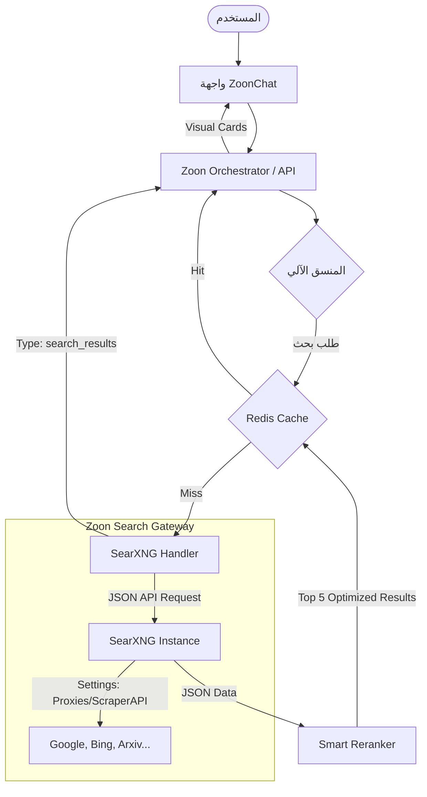

# 🌐 استراتيجية دمج محرك SearXNG في نظام Zoon OS

هذا المستند يشرح الرؤية التقنية والسيناريو العملي لاستبدال آليات البحث التقليدية بمحرك بحث سيادي وخاص (Private Search Engine) يعتمد على **SearXNG**، متأثراً بتجربة مشاريع عالمية ناجحة مثل **Morphic** و **Perplexica**.

## 1. الفكرة (The Core Idea)

تنتقل الفكرة من كَوْن الوكيل (Agent) مجرد "قارئ للمواقع" إلى كَوْنه "باحثاً استراتيجياً". بدلاً من الاعتماد على **DuckDuckGo** أو **Google RSS** (التي قد تفرض قيوداً أو تتغير هياكلها فجأة)، نقوم بامتلاك "بوابة بحث" (Search Gateway) خاصة بنا.

**SearXNG** هو محرك بحث "فوقي" (Meta-search engine) يجمع النتائج من أكثر من 70 محرك بحث آخر ويعيدها بصيغة JSON نظيفة، مما يجعله المحرك المثالي للذكاء الاصطناعي.

## 2. السيناريو (The Scenario)

### أ- الوضع الحالي (Current State)
1. المستخدم يطلب البحث عن خبر.
2. الوكيل يستخدم مكتبة `Playwright` لمحاكاة متصفح أو يقرأ خوارزمية RSS.
3. التحدي: استهلاك عالي لموارد الخادم (CPU/RAM)، بطء في الاستجابة، خطر الحظر (Rate Limiting).

### ب- الوضع المستهدف (Future State)
1. المستخدم يطلب البحث.
2. الوكيل يرسل طلب Fetch بسيط لـ API خادم SearXNG الخاص.
3. الخادم يعيد قائمة مهيكلة (تحتوي على العنوان، الرابط، المقتبس، والمصدر).
4. الوكيل يقوم بـ "ترشيح" (Filter) النتائج واختيار الأنسب منها فوراً.
5. عرض النتيجة في واجهة `ZoonChat` ببطاقات احترافية تشبه Morphic.

## 3. آلية العمل البرمجية (Technical Mechanism)

تعتمد الآلية على الفصل الواضح بين الأدوات (Tools) والمحركات (Handlers) مع دمج طبقة تحسين ناتجة عن التحليل العميق لمتطلبات الإنتاج:

## 4. تحسينات بيئة الإنتاج (Production-Ready Enhancements)

لضمان عمل النظام بكفاءة Morphic ودقة Perplexica، تم اعتماد الاستراتيجيات التالية:

### أ- إدارة نافذة السياق (Context Window & Reranking)
بدلاً من إرسال كافة نتائج SearXNG (التي قد تصل لـ 50 نتيجة) إلى النموذج الذكي، نعتمد خوارزمية **إعادة الترتيب (Reranking)** لاختيار أفضل 5 نتائج فقط. هذا يقلل استهلاك الـ Tokens بنسبة 70% ويزيد من دقة الإجابة.

### ب- استمرارية الخدمة (Rate Limiting & Proxies)
تجنباً لعمليات الحظر من محركات البحث الكبرى، يتم ضبط SearXNG لاستخدام **Proxies** أو دمج خدمات مثل **ScraperAPI** كمحرك خلفي. هذا يضمن بقاء البحث متاحاً 24/7 حتى مع آلاف الطلبات.

### ج- نظام التخزين المؤقت (Redis Caching)
تم اقتراح طبقة Redis بين المنسق ومحرك البحث. إذا تكرر نفس الاستعلام من مستخدمين مختلفين (مثلاً: "سعر الذهب اليوم")، يتم جلب النتيجة من الكاش في ملي ثانية بدلاً من إعادة البحث، مما يوفر الموارد ويسرع التجربة.

### د- الاختيار الذكي للأداة (Tool Choice: Auto)
باستخدام Vercel AI SDK، يتم تفعيل `toolChoice: 'auto'`. الوكيل هو من يقرر متى يحتاج SearXNG (للمعلومات العامة والأخبار) ومتى يعتمد على معرفته الداخلية، مما يحسن من "ذكاء" النظام واستهلاك الموارد.

## 5. الميزات التنافسية (Key Benefits)

| الميزة | الوصف |
| :--- | :--- |
| **خصوصية كاملة** | لا توجد سجلات بحث مخزنة لدى شركات كبرى (Privacy by Design). |
| **تكلفة صفرية** | استبدال اشتراكات Tavily API المكلفة بطلب API داخلي مجاني. |
| **سيادة تقنية** | التحكم الكامل في محركات البحث المفعلة ومصادر البيانات. |
| **أداء فائق** | زمن استجابة منخفض بفضل التحويل من Scraping إلى JSON API. |

---

> **خاتمة المعمارية**: دمج هذه التحسينات يحول Zoon OS من مجرد مشروع تجريبي إلى منصة سيادية (Sovereign Platform) قادرة على منافسة الأنظمة العالمية، مع ضمان استقرار الأداء وتقليل التكاليف التشغيلية بشكل جذري.
