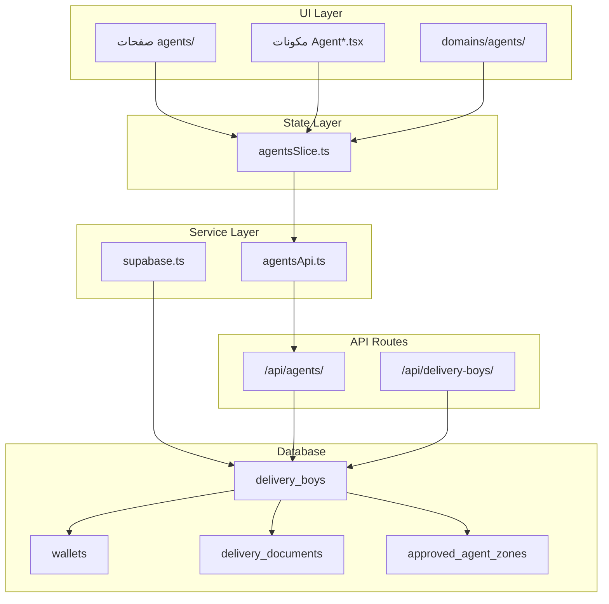
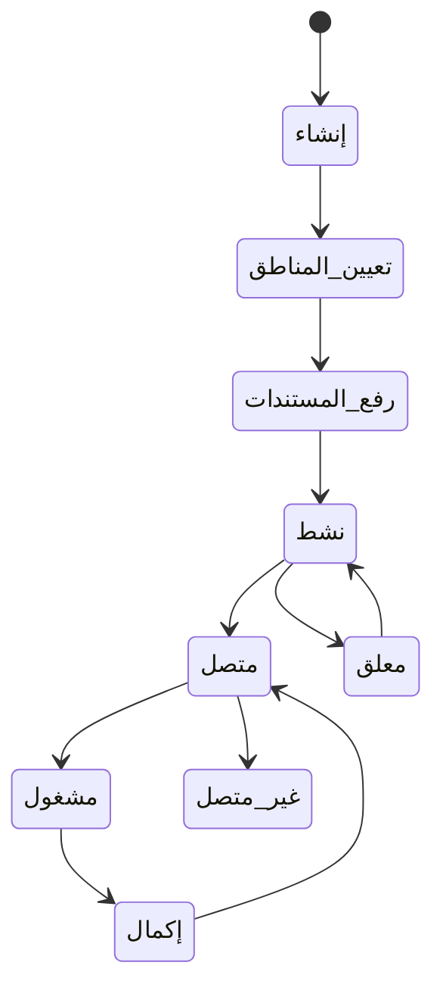

# 📋 التحليل الشامل لنظام الوكيل (Agent) في تطبيق كارمش

> **إعداد:** مدير المشروع التقني | **التاريخ:** 2026-04-03 | **الإصدار:** 1.0  
> **الغرض:** مستند استشاري مفصل لفريق البرمجة وصناع القرار الإداري  
> **التصنيف:** مستند تقني - سري

---

## فهرس المحتويات

1. [الملخص التنفيذي](#1-الملخص-التنفيذي)
2. [تعريف كيان الوكيل](#2-تعريف-كيان-الوكيل)
3. [البنية التقنية المعمارية](#3-البنية-التقنية-المعمارية)
4. [نماذج البيانات](#4-نماذج-البيانات)
5. [طبقة الخدمات](#5-طبقة-الخدمات)
6. [إدارة الحالة Redux](#6-إدارة-الحالة-redux)
7. [واجهات API الخلفية](#7-واجهات-api-الخلفية)
8. [مكونات واجهة المستخدم](#8-مكونات-واجهة-المستخدم)
9. [دورة حياة الوكيل](#9-دورة-حياة-الوكيل)
10. [التتبع الجغرافي والخرائط](#10-التتبع-الجغرافي-والخرائط)
11. [نظام المناطق والمستندات](#11-نظام-المناطق-والمستندات)
12. [نظام الأمان والحماية](#12-نظام-الأمان-والحماية)
13. [التكامل مع الأنظمة الفرعية](#13-التكامل-مع-الأنظمة-الفرعية)
14. [نقاط القوة](#14-نقاط-القوة)
15. [نقاط الضعف والتوصيات](#15-نقاط-الضعف-والتوصيات)
16. [خارطة الملفات المرجعية](#16-خارطة-الملفات-المرجعية)

---

## 1. الملخص التنفيذي

تطبيق **كارمش (Karmesh)** هو لوحة تحكم إدارية لعمليات جمع النفايات والتوصيل. كيان **"الوكيل"** هو الركيزة الأساسية — الكيان الميداني الذي ينفذ جميع العمليات على أرض الواقع.

| البند | القيمة |
|---|---|
| **إطار العمل** | Next.js 15.5 (App Router) + TypeScript |
| **قاعدة البيانات** | Supabase (PostgreSQL) + Prisma ORM |
| **إدارة الحالة** | Redux Toolkit مع Async Thunks |
| **التصميم** | Tailwind CSS + Radix UI (shadcn/ui) |
| **الجدول الرئيسي** | `delivery_boys` |
| **مكونات UI** | +20 مكون |
| **API Routes** | 8 مسارات |

> [!IMPORTANT]
> يوجد ازدواجية في التسمية: `Agent` (واجهة المستخدم)، `DeliveryBoy` (قاعدة البيانات)، `ApprovedAgent` (المعتمدين). تحتاج توحيداً مستقبلياً.

---

## 2. تعريف كيان الوكيل

### المسؤوليات
- **جمع النفايات** من العملاء (المهمة الأساسية)
- **توصيل الطلبات** وتنفيذ المهام الميدانية
- **وزن وتصنيف** المواد المجموعة
- **التتبع الجغرافي المباشر** أثناء المهام

### حالات الوكيل

| الحالة | القيمة | التفعيل |
|---|---|---|
| نشط | `active` | يمكنه تسجيل الدخول |
| غير نشط | `inactive` | لا يمكنه العمل |
| معلق | `suspended` | إيقاف إداري مؤقت |
| متصل | `online` | جاهز لاستقبال المهام |
| غير متصل | `offline` | خارج التطبيق |
| مشغول | `busy` | ينفذ مهمة حالياً |

### المركبات المدعومة
- `tricycle` — دراجة ثلاثية (أحمال خفيفة)
- `pickup_truck` — بيك أب (أحمال متوسطة)
- `light_truck` — شاحنة خفيفة (أحمال كبيرة)

---

## 3. البنية التقنية المعمارية



### تدفق البيانات
```
المشرف → مكون UI → dispatch(thunk) → Service API → API Route/Supabase → DB → Redux State → UI
```

---

## 4. نماذج البيانات

### النموذج الأساسي `Agent` ([types/index.ts](file:///d:/karmesh_githup/%D8%A8%D9%8A%D9%83%D8%A8%20%D8%A8%D8%AA%D8%A7%D8%B1%D9%8A%D8%AE%204-7/delivery-agent-dashboard/delivery_agent_final_25-12/src/types/index.ts))

```typescript
interface Agent {
  id: string; name: string;
  status: "online" | "offline" | "busy";
  location?: GeoPoint;
  rating?: number; total_deliveries?: number;
  phone?: string; preferred_vehicle?: string;
  delivery_code?: string;      // كود التسليم الفريد
  referral_code?: string;      // كود الإحالة
  badge_level?: number;        // مستوى الشارة
}
```

### النموذج المعزز `DeliveryBoy`

حقول إضافية: `date_of_birth`, `national_id`, `phone_verification_status`, `is_available`, `device_info`, `average_response_time`, `completed_orders_count`, `canceled_orders_count`, `preferred_zones`, `last_performance_review`

### نموذج الأداء اليومي

```typescript
interface DeliveryBoyDailyPerformance {
  orders_completed: number;
  orders_canceled: number;
  total_distance: number;
  total_earnings: number;
  average_rating: number;
  online_hours: number;
  waste_weight_collected: number;
}
```

---

## 5. طبقة الخدمات

### خدمة `agentsApi` ([agentsApi.ts](file:///d:/karmesh_githup/%D8%A8%D9%8A%D9%83%D8%A8%20%D8%A8%D8%AA%D8%A7%D8%B1%D9%8A%D8%AE%204-7/delivery-agent-dashboard/delivery_agent_final_25-12/src/services/agentsApi.ts))

| الوظيفة | الوصف | الاتصال |
|---|---|---|
| `getAll()` | جلب جميع المندوبين | Supabase مباشر |
| `getActive()` | المندوبين النشطين | Supabase View |
| `getById(id)` | مندوب محدد | Supabase مباشر |
| `updateStatus(id, status)` | تحديث الحالة | Supabase مباشر |
| `updateDetails(id, data)` | تحديث التفاصيل | API Route (`PUT`) |
| `create(payload)` | إنشاء مندوب جديد | Supabase Auth + Insert |

### دوال Supabase المباشرة ([supabase.ts](file:///d:/karmesh_githup/%D8%A8%D9%8A%D9%83%D8%A8%20%D8%A8%D8%AA%D8%A7%D8%B1%D9%8A%D8%AE%204-7/delivery-agent-dashboard/delivery_agent_final_25-12/src/lib/supabase.ts))

الملف الأكبر (~1934 سطر) يحتوي على: `getAgents()`, `getDeliveryBoys()`, `updateAgentStatus()`, `createDeliveryBoy()`, `addDeliveryZone()`, `uploadDeliveryDocument()`, وأكثر.

> [!NOTE]
> بعض الوظائف تتصل بـ Supabase مباشرة والبعض يمر عبر API Routes — ازدواجية تعكس تطور المشروع.

---

## 6. إدارة الحالة Redux

### شريحة الوكلاء ([agentsSlice.ts](file:///d:/karmesh_githup/%D8%A8%D9%8A%D9%83%D8%A8%20%D8%A8%D8%AA%D8%A7%D8%B1%D9%8A%D8%AE%204-7/delivery-agent-dashboard/delivery_agent_final_25-12/src/store/agentsSlice.ts))

```typescript
interface AgentsState {
  items: Agent[];              // كل المندوبين
  activeAgents: Agent[];       // النشطين فقط
  selectedAgent: Agent | null; // المحدد حالياً
  status: 'idle' | 'loading' | 'succeeded' | 'failed';
  error: string | null;
}
```

### العمليات غير المتزامنة

| Thunk | الوصف |
|---|---|
| `fetchAgents` | جلب الكل |
| `fetchActiveAgents` | جلب النشطين |
| `updateAgentStatus` | تحديث الحالة |
| `updateAgentDetails` | تحديث التفاصيل |
| `createAgent` | إنشاء جديد (مع rollback) |

المتجر يحتوي على **30 شريحة** مختلفة — الوكلاء واحدة من أهمها.

---

## 7. واجهات API الخلفية

### إنشاء مندوب (`POST /api/delivery-boys/`)

آلية **Fallback من 3 مراحل:**
1. ✅ `admin_create_delivery_boy` (RPC Function)
2. ❌ → `insert_delivery_boy_bypass_fk` (SQL مخصص)
3. ❌ → إدراج مباشر في `delivery_boys_insecure`

> [!WARNING]
> استخدام 3 طرق fallback يشير لتحديات سابقة مع Foreign Key constraints. يُنصح بتثبيت طريقة واحدة موثوقة.

### المسارات المتاحة

| المسار | الوظيفة |
|---|---|
| `GET/PUT /api/agents/[id]` | جلب/تحديث مندوب |
| `POST /api/delivery-boys` | إنشاء مندوب جديد |
| `/api/agents/[id]/zones` | إدارة المناطق |
| `/api/agents/[id]/regenerate-code` | إعادة توليد الكود |
| `/api/agents/update-profile-image` | تحديث الصورة |
| `/api/agents/login-by-code` | تسجيل دخول بالكود |
| `/api/agents/reset-password` | إعادة تعيين كلمة المرور |

---

## 8. مكونات واجهة المستخدم

### خريطة المكونات الرئيسية

| المكون | الحجم | الوظيفة |
|---|---|---|
| [FullAddAgentForm](file:///d:/karmesh_githup/%D8%A8%D9%8A%D9%83%D8%A8%20%D8%A8%D8%AA%D8%A7%D8%B1%D9%8A%D8%AE%204-7/delivery-agent-dashboard/delivery_agent_final_25-12/src/components/FullAddAgentForm.tsx) | 640 سطر | إضافة مندوب كامل |
| [EditAgentForm](file:///d:/karmesh_githup/%D8%A8%D9%8A%D9%83%D8%A8%20%D8%A8%D8%AA%D8%A7%D8%B1%D9%8A%D8%AE%204-7/delivery-agent-dashboard/delivery_agent_final_25-12/src/components/EditAgentForm.tsx) | 429 سطر | تعديل البيانات |
| [AgentSummary](file:///d:/karmesh_githup/%D8%A8%D9%8A%D9%83%D8%A8%20%D8%A8%D8%AA%D8%A7%D8%B1%D9%8A%D8%AE%204-7/delivery-agent-dashboard/delivery_agent_final_25-12/src/components/AgentSummary.tsx) | 454 سطر | ملخص + كود التسليم |
| [AgentZonesManager](file:///d:/karmesh_githup/%D8%A8%D9%8A%D9%83%D8%A8%20%D8%A8%D8%AA%D8%A7%D8%B1%D9%8A%D8%AE%204-7/delivery-agent-dashboard/delivery_agent_final_25-12/src/components/AgentZonesManager.tsx) | 424 سطر | إدارة المناطق |
| [UploadAgentDocuments](file:///d:/karmesh_githup/%D8%A8%D9%8A%D9%83%D8%A8%20%D8%A8%D8%AA%D8%A7%D8%B1%D9%8A%D8%AE%204-7/delivery-agent-dashboard/delivery_agent_final_25-12/src/components/UploadAgentDocuments.tsx) | 490 سطر | رفع الوثائق |
| [OrderTrackingView](file:///d:/karmesh_githup/%D8%A8%D9%8A%D9%83%D8%A8%20%D8%A8%D8%AA%D8%A7%D8%B1%D9%8A%D8%AE%204-7/delivery-agent-dashboard/delivery_agent_final_25-12/src/components/OrderTrackingView.tsx) | 717 سطر | تتبع الطلب |

### التدفق بعد الإنشاء

```
إنشاء → توليد delivery_code → عرض AgentSummary → إرسال عبر WhatsApp/SMS → تعيين المناطق → رفع المستندات → إتمام
```

---

## 9. دورة حياة الوكيل



---

## 10. التتبع الجغرافي والخرائط

### مصادر بيانات الموقع
1. `delivery_boys` — `current_latitude/longitude`
2. `tracking_points_with_details` — سجل التتبع التفصيلي
3. `order_tracking` — تتبع الطلبات (fallback)

### المكتبات: Leaflet + React-Leaflet + Leaflet-Draw

---

## 11. نظام المناطق والمستندات

### المناطق الجغرافية
- إضافة/حذف/تعطيل مناطق
- نوعان: **أساسية** و**ثانوية**
- ربط بالمناطق الجغرافية المسجلة في النظام

### المستندات المدعومة

| النوع | يتطلب انتهاء |
|---|---|
| الهوية الوطنية | ✅ |
| رخصة القيادة | ✅ |
| الصورة الشخصية | ❌ |
| استمارة المركبة | ✅ |

آلية: رفع → Supabase Storage → تسجيل في `delivery_documents` → تحديث `profile_image_url` إذا كانت صورة شخصية.

---

## 12. نظام الأمان والحماية

### Middleware ([middleware.ts](file:///d:/karmesh_githup/%D8%A8%D9%8A%D9%83%D8%A8%20%D8%A8%D8%AA%D8%A7%D8%B1%D9%8A%D8%AE%204-7/delivery-agent-dashboard/delivery_agent_final_25-12/src/middleware.ts))
```
طلب → Rate Limiting → فحص أمان → مصادقة → فحص مدخلات → تسجيل → تمرير
```

### Rate Limiting ([rateLimiter.ts](file:///d:/karmesh_githup/%D8%A8%D9%8A%D9%83%D8%A8%20%D8%A8%D8%AA%D8%A7%D8%B1%D9%8A%D8%AE%204-7/delivery-agent-dashboard/delivery_agent_final_25-12/src/lib/rateLimiter.ts)) — 7 مستويات

| المستوى | النافذة | الحد |
|---|---|---|
| عام | 15 دقيقة | 1000 |
| مصادقة | 15 دقيقة | 5 |
| حساس | 10 دقائق | 10 |
| أمني | 5 دقائق | 3 |
| مستخدم | دقيقة | 100 |
| بحث | دقيقة | 20 |

### Audit Logger ([auditLogger.ts](file:///d:/karmesh_githup/%D8%A8%D9%8A%D9%83%D8%A8%20%D8%A8%D8%AA%D8%A7%D8%B1%D9%8A%D8%AE%204-7/delivery-agent-dashboard/delivery_agent_final_25-12/src/lib/auditLogger.ts))
- تنظيف تلقائي للبيانات الحساسة
- إرسال فوري للأحداث الحرجة
- دعم Batch processing (كل 30 ثانية)
- 4 مستويات خطورة: INFO, WARNING, ERROR, CRITICAL

---

## 13. التكامل مع الأنظمة الفرعية

| النظام | العلاقة |
|---|---|
| **الطلبات** | كل طلب يرتبط بمندوب عبر `delivery_boy_id` |
| **جمع النفايات** | `waste_collection_sessions` مرتبطة بالمندوب |
| **المحفظة** | محفظة مالية لكل مندوب (`DELIVERY_BOY_WALLET`) تُنشأ تلقائياً |
| **الرسائل** | محادثات مرتبطة بالمندوب |
| **التحليلات** | إحصائيات أداء (مندوبين نشطين، متوسط التوصيل، كفاءة الجمع) |

---

## 14. نقاط القوة

- ✅ **معمارية Feature-Based** واضحة مع فصل النطاقات
- ✅ **Redux Toolkit** مع Async Thunks احترافية
- ✅ **TypeScript صارم** مع تعريفات شاملة
- ✅ **أمان متعدد الطبقات** (Middleware + Rate Limiting + Audit)
- ✅ **دورة حياة كاملة** (إنشاء → مناطق → مستندات → تشغيل)
- ✅ **تتبع جغرافي متقدم** (Leaflet + نقاط تتبع مع سرعة واتجاه)
- ✅ **نظام مستندات متكامل** مع تتبع الانتهاء والتحقق

---

## 15. نقاط الضعف والتوصيات

### 🔴 حرج

| المشكلة | التوصية |
|---|---|
| `localStorage` في Middleware (server-side) | استبدال بـ cookie-based أو في-ميموري |
| حظر `node` في User-Agent | إزالته لأنه يحظر Server requests شرعية |
| `select('*')` في استعلامات عديدة | استخدام `select()` محددة لتحسين الأداء |

### 🟡 متوسط

| المشكلة | التوصية |
|---|---|
| ازدواجية Agent/DeliveryBoy/ApprovedAgent | توحيد في واجهة موحدة |
| 3 طرق fallback للإنشاء | تثبيت طريقة واحدة |
| ملف `supabase.ts` ضخم (~1934 سطر) | تقسيم حسب الكيان |
| عدم وجود حذف فعلي | تطبيق soft/hard delete |

### 🟢 مستقبلي

| التحسين | الفائدة |
|---|---|
| Real-time Subscriptions | تحديث فوري للموقع |
| Push Notifications | إشعارات للمهام الجديدة |
| AI-based Routing | مسارات ذكية |
| Offline Mode | عمل بدون اتصال |

---

## 16. خارطة الملفات المرجعية

| الطبقة | الملف |
|---|---|
| الأنواع | [types/index.ts](file:///d:/karmesh_githup/%D8%A8%D9%8A%D9%83%D8%A8%20%D8%A8%D8%AA%D8%A7%D8%B1%D9%8A%D8%AE%204-7/delivery-agent-dashboard/delivery_agent_final_25-12/src/types/index.ts) |
| الخدمات | [services/agentsApi.ts](file:///d:/karmesh_githup/%D8%A8%D9%8A%D9%83%D8%A8%20%D8%A8%D8%AA%D8%A7%D8%B1%D9%8A%D8%AE%204-7/delivery-agent-dashboard/delivery_agent_final_25-12/src/services/agentsApi.ts) |
| Supabase | [lib/supabase.ts](file:///d:/karmesh_githup/%D8%A8%D9%8A%D9%83%D8%A8%20%D8%A8%D8%AA%D8%A7%D8%B1%D9%8A%D8%AE%204-7/delivery-agent-dashboard/delivery_agent_final_25-12/src/lib/supabase.ts) |
| Redux | [store/agentsSlice.ts](file:///d:/karmesh_githup/%D8%A8%D9%8A%D9%83%D8%A8%20%D8%A8%D8%AA%D8%A7%D8%B1%D9%8A%D8%AE%204-7/delivery-agent-dashboard/delivery_agent_final_25-12/src/store/agentsSlice.ts) |
| API | [api/agents/agentId/route.ts](file:///d:/karmesh_githup/%D8%A8%D9%8A%D9%83%D8%A8%20%D8%A8%D8%AA%D8%A7%D8%B1%D9%8A%D8%AE%204-7/delivery-agent-dashboard/delivery_agent_final_25-12/src/app/api/agents/%5BagentId%5D/route.ts) |
| API | [api/delivery-boys/route.ts](file:///d:/karmesh_githup/%D8%A8%D9%8A%D9%83%D8%A8%20%D8%A8%D8%AA%D8%A7%D8%B1%D9%8A%D8%AE%204-7/delivery-agent-dashboard/delivery_agent_final_25-12/src/app/api/delivery-boys/route.ts) |
| Middleware | [middleware.ts](file:///d:/karmesh_githup/%D8%A8%D9%8A%D9%83%D8%A8%20%D8%A8%D8%AA%D8%A7%D8%B1%D9%8A%D8%AE%204-7/delivery-agent-dashboard/delivery_agent_final_25-12/src/middleware.ts) |
| Rate Limiting | [lib/rateLimiter.ts](file:///d:/karmesh_githup/%D8%A8%D9%8A%D9%83%D8%A8%20%D8%A8%D8%AA%D8%A7%D8%B1%D9%8A%D8%AE%204-7/delivery-agent-dashboard/delivery_agent_final_25-12/src/lib/rateLimiter.ts) |
| Audit | [lib/auditLogger.ts](file:///d:/karmesh_githup/%D8%A8%D9%8A%D9%83%D8%A8%20%D8%A8%D8%AA%D8%A7%D8%B1%D9%8A%D8%AE%204-7/delivery-agent-dashboard/delivery_agent_final_25-12/src/lib/auditLogger.ts) |

---

*تم إعداد هذا المستند بواسطة مدير المشروع التقني — كارمش ©2026*
