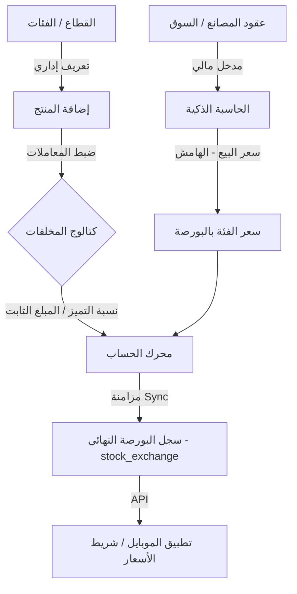

# تحليل بنية نظام البورصة وتقرير دعم القرار ⚖️

هذا المستند يقدم تحليلاً عميقاً لهيكلية نظام "البورصة" الحالي في **Karmesh**، ويجيب على التساؤلات حول تعقيد النظام والمسؤوليات الإدارية.

---

## 1. مخطط سير العمل الحالي (Current Workflow Diagram)

---

## 2. تحليل البنية (Architecture Analysis)

### هل النظام معقد (Over-engineered)؟
**رأيي الفني:** لا، النظام ليس "Over-engineered" بل هو نظام **"قابل للتوسع" (Scalable Architecture)**. 
*   **لو كان النظام بسيطاً:** لكنت تضع سعراً يدوياً لكل منتج. (هذا مرهق إدارياً عند وجود مئات المنتجات وتغير الأسعار يومياً).
*   **النظام الحالي (الهرمي):** يسمح لك بتغيير سعر "فئة كاملة" (مثل النحاس) بضغطة واحدة، ليقوم النظام بتعديل أسعار 50 صنفاً تابعاً لها تلقائياً بناءً على جودتها.

### توزيع المسؤوليات (Administrative vs Financial)
**السؤال:** هل يجب أن تكون المالية هي المسؤولة الوحيدة؟
**التحليل:**
1.  **المسؤولية الإدارية:** (إضافة المنتج وتصنيفه) هي عملية تقنية/فنية. الموظف الفني يعرف الفرق بين "بوردة إنتل" و "بوردة صينية" ويضع "نسبة التميز" بناءً على خبرته الفنية.
2.  **المسؤولية المالية:** (البورصة والحاسبة) هي عملية سوقية. المدير المالي يراقب سعر العقود وهوامش الربح.

**الرأي:** الفصل الحالي صحيح جداً ويتبع مبدأ **Separation of Concerns**. المالية لا تشغل بالها بإضافة المنتجات، والإدارة الفنية لا تشغل بالها بتقلبات أسعار السوق.

---

## 3. نقاط القوة والضعف (Pros & Cons)

| النقطة | الحالة | التأثير |
| :--- | :--- | :--- |
| **الدقة** | ✅ عالية جداً | كل منتج يتم تسعيره بدقة رياضية. |
| **السرعة الإدارية** | ✅ ممتازة | تحديث سعر فئة واحدة يُحدث كل المنتجات المرتبطة. |
| **سهولة الاستخدام** | ⚠️ متوسطة | تتطلب فهماً لدورة المزامنة (Sync). |
| **تكامل الموبايل** | ❌ ضعيفة | يوجد فجوة في عرض البيانات الحية (تُعالج حالياً). |

---

## 4. رأي استشاري لدعم القرار (Decision Support)

بناءً على مراجعة الكود والآلية الإدارية، أنصح بالآتي:

1.  **الاحتفاظ بالنظام الحالي:** لأنه يحمي هوامش ربح الشركة بشكل آلي (عبر الحاسبة الذكية) ويقلل الخطأ البشري في إدخال الأسعار الفردية.
2.  **تبسيط "واجهة المستخدم" لموظفي الموبايل:** الخلل ليس في "قاعدة البيانات" بل في "طريقة العرض". الموبايل يجب أن يقرأ من المصب النهائي (`stock_exchange`) فقط لتبسيط الأمور عليهم.
3.  **أتمتة المزامنة (Auto-Sync):** أنصح بجعل عملية المزامنة "تلقائية" فور حفظ السعر في البورصة لمنع نسيان الضغط على زر المزامنة.

### الخلاصة:
النظام الحالي هو **"قلب العمليات"** في كرمش. تصميمه يراعي أنك شركة تعمل في سوق متقلب (البورصة)، وأي تبسيط مخل (مثل وضع أسعار يدوية ثابتة) سيؤدي لخسائر مالية نتيجة عدم مواكبة أسعار المصانع.

---
*إعداد: Antigravity AI - نظام دعم القرار*
