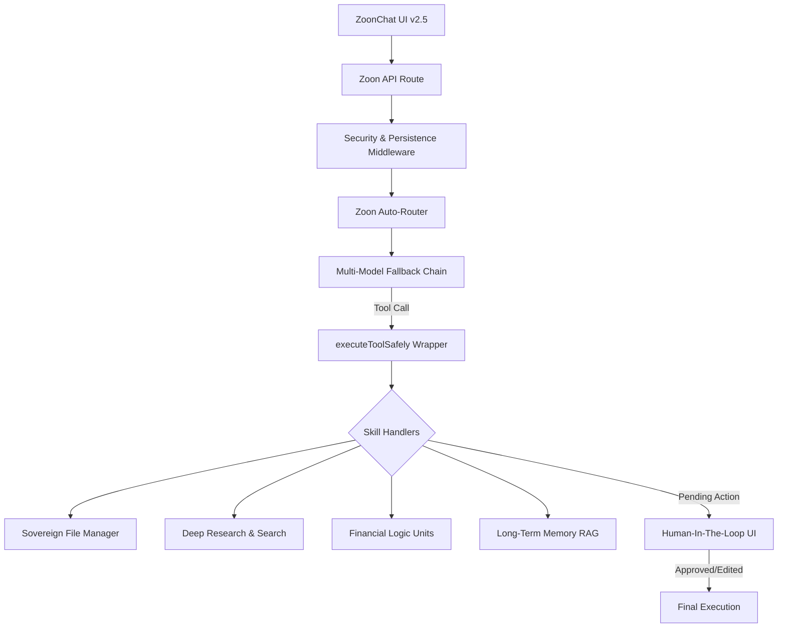

# المستند الفني الشامل: الحالة الراهنة ومعمارية Zoon OS (v2.5 - أبريل 2026)

> [!NOTE]
> هذا المستند يمثل الحالة التقنية "الفعلية" للنظام كما هي منفذة في الكود المصدري، مع تفصيل كامل لكل الوحدات البرمجية والمسارات الوظيفية. تم تحديثه ليعكس ترقيات أبريل 2026.

---

## 🏗️ 1. المخطط المعماري العام (System Blueprint)

يعتمد Zoon OS على بنية **Node-Based Hybrid Architecture**، حيث يتم الفصل بين محرك التفكير (LLM) ومحرك التنفيذ (Handlers).

---

## ⚡ 2. المكونات التقنية قيد التشغيل (Active Stack)

### 2.1. سلسلة النماذج التكيفية v2.5 (The Intelligence Layer)
تم تنفيذ آلية "البقاء الرقمي" لضمان عدم توقف الخدمة:
- **الموديل الأساسي:** `gemini-2.0-flash-exp` (سرعة فائقة واستدعاء أدوات دقيق).
- **موديل المهام المعقدة:** `gemini-2.0-pro-exp` (لتحليل الروابط الضخمة).
- **خط الدفاع الأول (Fallback):** `llama-3.3-70b-versatile` (عبر Groq API).
- **الاستقرار:** نظام إدارة الكاش في الـ Thunks يمنع تكرار الاستدعاءات المكلفة.

### 2.2. مُعلّم الأدوات السيادي (Sovereign Tools)
تخلص Zoon OS من الاعتماد الكلي على الويب، وأصبح لديه مهارات محلية (Native Handlers):
1.  **مدير الملفات (File-Handler):** تنفيذ `fileRead`, `fileWrite`, `filePatch`, `fileDelete` داخل مجلدات مؤمنة (`docs/generated`).
2.  **المعالج المالي (Finance-Handler):** حساب أرباح الوكيل، مستحقات المناديب، وتصفية الحسابات آلياً.
3.  **المكتشف الاستباقي (Pulse Engine):** مسار `/api/zoon/discovery/pulse` الذي يجري عمليات استشكاف صامتة.
    > [!IMPORTANT]
    > **ملاحظة التحويل الاستباقي:** المحرك جاهز برمجياً، ولتحويله من "يدوي" إلى "استباقي حقيقي" (Truly Proactive)، يجب ربط المسار بـ **Vercel Cron Job** أو تفعيل **pg_cron** في Supabase لضمان التنفيذ الدوري (مثلاً كل 6 ساعات) دون تدخل بشري.

---

## 🛠️ 3. التحليلات التقنية المنفذة (Verified Workflows)

### 3.1. التفاعلية (Human-In-The-Loop)
تم دمج نظام HITL في `ZoonChat.tsx` ليدعم:
- **المعاينة المسبقة (Preview):** عرض شكل المنشور قبل رفعه.
- **التعديل الحي (In-line Editing):** إمكانية تعديل النص المقترح من الذكاء الاصطناعي بالكامل قبل الموافقة.
- **التوجيه (Guidance):** رفض الفعل مع تقديم ملاحظة للوكيل ليعيد المحاولة بدقة أكبر.

### 3.2. الذاكرة الدلالية (Vector Memory)
- **قاعدة البيانات:** استغلال `pgvector` في Supabase.
- **الآلية:** حفظ خلاصة المحادثات والبيانات الهامة وتصنيفها دلالياً.
- **الاسترجاع:** استخدام دالة `match_search_memories` لإدراج سياق المستخدم في كل "Prompt" جديد.

### 3.3. البحث المتعدد (Multi-Source Discovery)
- **News Logic:** سحب الأخبار وتنسيقها في بطاقات (UI Cards).
- **Gallery Mode:** عرض نتائج البحث عن الصور بشكل احترافي مع تحليل محتواها بصرياً.
- **Scraping:** استخدام تكنولوجيا `Firecrawl` و `Puppeteer` لقراءة المواقع المحمية.

---

## 📊 4. سجل الترقيات (April 2026 Changelog)

| الميزة | الحالة | الموقع البرمجي |
| :--- | :--- | :--- |
| **Model Fallback Chain** | ✅ مستقر | `src/app/api/zoon/route.ts` |
| **Sovereign File Tool** | ✅ فعال | `zoon-os/functions/handlers/file-handlers.ts` |
| **Proactive Pulse** | 🟡 جاري التفعيل | يعمل يدوياً (بانتظار ربط Cron Job) |
| **HITL Edit Support** | ✅ متوفر | `src/domains/zoon-os/components/ZoonChat.tsx` |
| **Security Wrapper** | ✅ مؤمن | `lib/executeToolSafely.ts` |

---

## 🚧 5. التحديات والأهداف القادمة (Future Pipeline)

> [!IMPORTANT]
> لتحقيق السيادة الكاملة، نحتاج للتركيز على:

1.  **بروتوكول MCP (Model Context Protocol):** الوصول المباشر للجداول.
2.  **تفعيل الاستباقية الحقيقية (True Proactiveness):** ربط المحرك بـ **Vercel Cron** أو **pg_cron** للتشغيل الآلي للمسار `/api/zoon/discovery/pulse`.
3.  **تحسين الـ OCR العربي:** معالجة تعقيدات اللغة العربية في الفواتير.
4.  **Multi-Agent Swarm (The Council):** تفعيل محادثة بين عدة وكلاء.

---
**إعداد:** مساعد Zoon الذكي
**الحالة:** تم التحديث والمراجعة الكاملة
**أبريل 2026**
