# Delivery Agent Application Database Documentation

This document outlines the database schema relevant to the delivery agent application.

## Relevant Tables

### `delivery_boys`

**الشرح:** الجدول الرئيسي لملفات تعريف مندوبي التوصيل وبياناتهم الأساسية وحالتهم.

| Column Name                       | Data Type                 | Nullable | Default                                  | Notes                                                 |
| --------------------------------- | ------------------------- | -------- | ---------------------------------------- | ----------------------------------------------------- |
| `id`                              | uuid                      | NO       |                                          | Primary Key, references `auth.users.id`               |
| `phone`                           | character varying         | NO       |                                          | Unique phone number                                   |
| `email`                           | character varying         | YES      |                                          | Email address                                         |
| `full_name`                       | character varying         | NO       |                                          | Full name                                             |
| `date_of_birth`                   | date                      | YES      |                                          | Date of birth                                         |
| `national_id`                     | character varying         | YES      |                                          | National ID number                                    |
| `preferred_vehicle`               | USER-DEFINED (vehicle_type) | YES      |                                          | Preferred vehicle type (`tricycle`, `pickup_truck`, `light_truck`) |
| `license_number`                  | character varying         | YES      |                                          | Driver's license number                               |
| `phone_verification_code`         | character varying         | YES      |                                          | Temporary code for phone verification                 |
| `phone_verification_expires_at`   | timestamp with time zone  | YES      |                                          | Expiry time for the verification code                 |
| `phone_verification_attempts`     | integer                   | YES      | 0                                        | Number of verification attempts                       |
| `delivery_code`                   | character varying         | YES      |                                          | Code used for delivery confirmation/login             |
| `delivery_code_expires_at`        | timestamp with time zone  | YES      |                                          | Expiry time for the delivery code                     |
| `delivery_code_attempts`          | integer                   | YES      | 0                                        | Number of delivery code attempts                      |
| `status`                          | USER-DEFINED (delivery_boy_status) | YES | 'inactive'::delivery_boy_status          | Agent status (`active`, `busy`, `inactive`, `suspended`) |
| `total_deliveries`                | integer                   | YES      | 0                                        | Total completed deliveries                            |
| `total_earnings`                  | numeric                   | YES      | 0                                        | Total earnings                                        |
| `rating`                          | numeric                   | YES      | 0                                        | Average customer rating                               |
| `current_latitude`                | numeric                   | YES      |                                          | Current latitude                                      |
| `current_longitude`               | numeric                   | YES      |                                          | Current longitude                                     |
| `is_available`                    | boolean                   | YES      | false                                    | Availability status for new orders                    |
| `last_location_update`            | timestamp with time zone  | YES      |                                          | Timestamp of the last location update                 |
| `referral_code`                   | character varying         | YES      |                                          | Referral code                                         |
| `notes`                           | text                      | YES      |                                          | Admin notes about the agent                           |
| `created_at`                      | timestamp with time zone  | YES      | CURRENT_TIMESTAMP                        | Record creation time                                  |
| `updated_at`                      | timestamp with time zone  | YES      | CURRENT_TIMESTAMP                        | Record last update time                               |
| `last_login`                      | timestamp with time zone  | YES      |                                          | Timestamp of the last login                           |
| `profile_image_url`               | text                      | YES      |                                          | URL of the profile picture                            |
| `avatar_url`                      | text                      | YES      |                                          | URL of the avatar (potentially same as profile_image_url) |
| `device_info`                     | jsonb                     | YES      |                                          | Information about the agent's device                  |
| `average_response_time`           | integer                   | YES      |                                          | Average order response time (e.g., in minutes)        |
| `completed_orders_count`          | integer                   | YES      | 0                                        | Count of completed orders (may overlap with total_deliveries) |
| `canceled_orders_count`           | integer                   | YES      | 0                                        | Count of canceled orders                              |
| `badge_level`                     | integer                   | YES      | 0                                        | Performance badge level                               |
| `last_performance_review`         | timestamp with time zone  | YES      |                                          | Timestamp of the last performance review              |
| `preferred_zones`                 | jsonb                     | YES      |                                          | Preferred delivery zones                              |
| `online_status`                   | USER-DEFINED (delivery_boy_online_status) | YES | 'offline'::delivery_boy_online_status | Online status (`online`, `offline`, `busy`)         |
| `identity_documents`              | jsonb                     | YES      |                                          | URLs or references to identity documents              |
| `license_photo_url`               | text                      | YES      |                                          | URL of the driver's license photo                   |
| `status_reason`                   | text                      | YES      |                                          | Reason for the current status (e.g., suspension)      |
| `status_changed_at`               | timestamp with time zone  | YES      |                                          | Timestamp of the last status change                   |
| `delivery_code_status`            | USER-DEFINED (verification_status) | YES | 'pending'::verification_status        | Status of delivery code verification                  |
| `phone_verification_status`       | USER-DEFINED (verification_status) | YES | 'pending'::verification_status        | Status of phone number verification                   |
| `preferred_language`              | character varying         | YES      | 'ar'::character varying                  | Preferred language (e.g., 'ar', 'en')                 |

### `delivery_orders`

**الشرح:** يمثل مهام التوصيل المعينة للمناديب، ويربط عادةً بطلبات العملاء (`customer_orders`).

| Column Name                 | Data Type                 | Nullable | Default             | Notes                                                    |
| --------------------------- | ------------------------- | -------- | ------------------- | -------------------------------------------------------- |
| `id`                        | uuid                      | NO       | uuid_generate_v4()  | Primary Key                                              |
| `delivery_boy_id`           | uuid                      | YES      |                     | Foreign Key referencing `delivery_boys.id` (assigned agent) |
| `customer_order_id`         | uuid                      | YES      |                     | Foreign Key referencing `customer_orders.id`             |
| `order_number`              | character varying         | NO       |                     | Unique identifier for the delivery order                 |
| `pickup_location`           | USER-DEFINED (geometry)   | NO       |                     | Geographic coordinates for pickup                        |
| `pickup_address`            | text                      | NO       |                     | Text representation of the pickup address                |
| `customer_name`             | character varying         | YES      |                     | Customer's name                                          |
| `customer_phone`            | character varying         | YES      |                     | Customer's phone number                                  |
| `estimated_distance`        | numeric                   | YES      |                     | Estimated travel distance                                |
| `estimated_time`            | integer                   | YES      |                     | Estimated travel time (e.g., in minutes)                 |
| `expected_total_amount`     | numeric                   | YES      |                     | Expected amount to be collected/paid                     |
| `actual_total_amount`       | numeric                   | YES      |                     | Actual amount collected/paid                             |
| `actual_pickup_time`        | timestamp with time zone  | YES      |                     | Timestamp when the order was actually picked up          |
| `actual_delivery_time`      | timestamp with time zone  | YES      |                     | Timestamp when the order was actually completed          |
| `notes`                     | text                      | YES      |                     | Notes related to the delivery                            |
| `voice_notes`               | jsonb                     | YES      |                     | References or data for voice notes                       |
| `created_at`                | timestamp with time zone  | YES      | CURRENT_TIMESTAMP   | Record creation time                                     |
| `updated_at`                | timestamp with time zone  | YES      | CURRENT_TIMESTAMP   | Record last update time                                  |
| `order_id`                  | uuid                      | YES      |                     | Possibly redundant FK to `customer_orders.id`?           |
| `user_type`                 | USER-DEFINED (user_type_enum) | NO    | 'household'::user_type_enum | Type of the customer (`household`, `business`, `distributor`) |
| `status`                    | USER-DEFINED (delivery_status_enum) | YES |                   | Current status of the delivery                           |
| `category_name`             | text                      | YES      |                     | Name of the waste category                             |
| `subcategory_name`          | text                      | YES      |                     | Name of the waste subcategory                          |
| `analytics_data`            | jsonb                     | YES      |                     | Additional data for analytics purposes                   |
| `customer_feedback`         | text                      | YES      |                     | Feedback provided by the customer for this order         |
| `delivery_route`            | jsonb                     | YES      |                     | Planned or actual delivery route data                    |
| `order_processing_time`     | integer                   | YES      |                     | Time taken to process the order (e.g., in minutes)       |
| `customer_waiting_time`     | integer                   | YES      |                     | Time the customer waited (e.g., in minutes)              |
| `priority`                  | USER-DEFINED (order_priority_enum) | YES | 'normal'::order_priority_enum | Order priority (`low`, `normal`, `high`, `urgent`)   |
| `delivery_location`         | USER-DEFINED (geometry)   | YES      |                     | Geographic coordinates for delivery (if different from pickup) |

### `delivery_locations`

**الشرح:** (يبدو أنه يتتبع مواقع المناديب، قد يكون مكررًا مع حقول الموقع في `delivery_boys` أو `order_tracking`. يحتاج للمراجعة).
*(Seems to track agent locations, potentially redundant. Details omitted for brevity)*

| Column Name       | Data Type                 | Nullable | Default        | Notes                                            |
| ----------------- | ------------------------- | -------- | -------------- | ------------------------------------------------ |
| `id`              | uuid                      | NO       | gen_random_uuid() | Primary Key                                      |
| `delivery_id`     | uuid                      | YES      |                | Foreign Key referencing `new_profiles_delivery.id`? |
| `latitude`        | numeric                   | NO       |                | Latitude                                         |
| `longitude`       | numeric                   | NO       |                | Longitude                                        |
| `status`          | character varying         | YES      |                | Associated status (e.g., 'tracking', 'idle')     |
| `updated_at`      | timestamp with time zone  | YES      | now()          | Timestamp of the location update                 |

### `order_tracking`

**الشرح:** يخزن نقاط الموقع الجغرافي التاريخية لتتبع مسار مندوب التوصيل أثناء تنفيذ الطلب.

| Column Name            | Data Type                           | Nullable | Default        | Notes                                                    |
| ---------------------- | ----------------------------------- | -------- | -------------- | -------------------------------------------------------- |
| `id`                   | uuid                                | NO       | uuid_generate_v4() | Primary Key                                              |
| `order_id`             | uuid                                | NO       |                | Foreign Key referencing `delivery_orders.id`             |
| `delivery_boy_id`      | uuid                                | NO       |                | Foreign Key referencing `delivery_boys.id`               |
| `latitude`             | double precision                    | NO       |                | Latitude at the time of tracking                         |
| `longitude`            | double precision                    | NO       |                | Longitude at the time of tracking                        |
| `speed`                | double precision                    | YES      |                | Speed at the time of tracking                            |
| `heading`              | double precision                    | YES      |                | Direction/heading at the time of tracking                |
| `timestamp`            | timestamp with time zone            | YES      | now()          | Timestamp of the tracking point                          |
| `status`               | USER-DEFINED (delivery_boy_online_status) | YES |                | Agent's online status at the time (`online`, `offline`, `busy`) |
| `active_status`        | USER-DEFINED (delivery_boy_status)  | YES      | 'inactive'::delivery_boy_status | Agent's administrative status (`active`, `busy`, `inactive`, `suspended`) |
| `available_for_orders` | boolean                             | YES      | false          | Agent's availability for new orders at the time        |

### `wallets`

**الشرح:** يخزن أرصدة المحافظ الإلكترونية للمستخدمين (قد يكون للمناديب محافظ خاصة بهم).

| Column Name   | Data Type                 | Nullable | Default               | Notes                                           |
| ------------- | ------------------------- | -------- | --------------------- | ----------------------------------------------- |
| `id`          | uuid                      | NO       | gen_random_uuid()     | Primary Key                                     |
| `user_id`     | uuid                      | NO       |                       | Foreign Key referencing user ID (e.g., `delivery_boys.id`) |
| `balance`     | numeric                   | NO       | 0.00                  | Current wallet balance                          |
| `currency`    | character varying         | NO       | 'EGP'::character varying | Currency code (e.g., 'EGP')                     |
| `is_active`   | boolean                   | NO       | true                  | Wallet status                                   |
| `created_at`  | timestamp with time zone  | NO       | now()                 | Record creation time                            |
| `updated_at`  | timestamp with time zone  | NO       | now()                 | Record last update time                         |

### `wallet_transactions`

**الشرح:** يسجل جميع المعاملات التي تتم على المحافظ الإلكترونية (إيداع، سحب، دفع QR، إلخ).

| Column Name       | Data Type                 | Nullable | Default                   | Notes                                                      |
| ----------------- | ------------------------- | -------- | ------------------------- | ---------------------------------------------------------- |
| `id`              | uuid                      | NO       | gen_random_uuid()         | Primary Key                                                |
| `wallet_id`       | uuid                      | NO       |                           | Foreign Key referencing `wallets.id`                       |
| `transaction_type`| USER-DEFINED (transaction_type) | NO   |                           | Type of transaction (`deposit`, `withdrawal`, `purchase`, `refund`, `exchange`, `qr_payment`) |
| `amount`          | numeric                   | NO       |                           | Transaction amount                                         |
| `status`          | USER-DEFINED (transaction_status) | NO | 'pending'::transaction_status | Transaction status (`pending`, `completed`, `failed`, etc.) |
| `qr_code_id`      | uuid                      | YES      |                           | FK referencing `payment_qr_codes.id` if QR payment       |
| `reference_id`    | character varying         | YES      |                           | External reference ID (e.g., order ID)                     |
| `description`     | text                      | YES      |                           | Description of the transaction                             |
| `metadata`        | jsonb                     | YES      |                           | Additional transaction data                                |
| `created_at`      | timestamp with time zone  | NO       | now()                     | Record creation time                                       |
| `updated_at`      | timestamp with time zone  | NO       | now()                     | Record last update time                                    |

### `payment_qr_codes`

**الشرح:** يخزن رموز QR التي يتم إنشاؤها لعمليات الدفع (عادةً ينشئها المندوب للعميل).

| Column Name         | Data Type                 | Nullable | Default                   | Notes                                            |
| ------------------- | ------------------------- | -------- | ------------------------- | ------------------------------------------------ |
| `id`                | uuid                      | NO       | gen_random_uuid()         | Primary Key                                      |
| `creator_id`        | uuid                      | NO       |                           | User ID of the creator (delivery agent)        |
| `recipient_id`      | uuid                      | NO       |                           | User ID of the recipient (customer)              |
| `amount`            | numeric                   | NO       |                           | Amount associated with the QR code               |
| `currency`          | character varying         | NO       | 'EGP'::character varying  | Currency code                                    |
| `status`            | USER-DEFINED (transaction_status) | NO | 'pending'::transaction_status | Status of the QR payment (`pending`, `verified`, etc.) |
| `expires_at`        | timestamp with time zone  | NO       |                           | Expiry time for the QR code                      |
| `verification_code` | character varying         | YES      |                           | Code used by recipient to verify payment         |
| `transaction_id`    | uuid                      | YES      |                           | FK referencing `wallet_transactions.id`          |
| `order_id`          | uuid                      | YES      |                           | FK referencing the related order                 |
| `metadata`          | jsonb                     | YES      |                           | Additional data related to the QR code           |
| `created_at`        | timestamp with time zone  | NO       | now()                     | Record creation time                             |
| `updated_at`        | timestamp with time zone  | NO       | now()                     | Record last update time                          |

### `delivery_earnings`

**الشرح:** (يتتبع الأرباح المحددة لكل عملية توصيل للمندوب).
*(Tracks earnings specific to deliveries. Details omitted for brevity)*

| Column Name    | Data Type                 | Nullable | Default                   | Notes                                             |
| -------------- | ------------------------- | -------- | ------------------------- | ------------------------------------------------- |
| `id`           | uuid                      | NO       | gen_random_uuid()         | Primary Key                                       |
| `delivery_id`  | uuid                      | YES      |                           | Foreign Key referencing agent ID (`delivery_boys.id`?) |
| `order_id`     | uuid                      | NO       |                           | Foreign Key referencing `delivery_orders.id`      |
| `amount`       | numeric                   | NO       |                           | Base earning amount for the delivery              |
| `bonus_amount` | numeric                   | YES      | 0.00                      | Bonus amount earned                               |
| `earning_type` | character varying         | YES      |                           | Type of earning (e.g., 'delivery_fee', 'bonus')   |
| `status`       | character varying         | YES      | 'pending'::character varying | Status of the earning (e.g., 'pending', 'paid') |
| `created_at`   | timestamp with time zone  | YES      | now()                     | Record creation time                              |
| `paid_at`      | timestamp with time zone  | YES      |                           | Timestamp when the earning was paid               |

### `delivery_performance_stats`

**الشرح:** (يخزن إحصائيات الأداء المجمعة للمناديب، ربما بشكل شهري).
*(Stores aggregated performance statistics for agents. Details omitted for brevity)*

| Column Name             | Data Type                 | Nullable | Default             | Notes                                           |
| ----------------------- | ------------------------- | -------- | ------------------- | ----------------------------------------------- |
| `id`                    | uuid                      | NO       | uuid_generate_v4()  | Primary Key                                     |
| `delivery_boy_id`       | uuid                      | YES      |                     | Foreign Key referencing `delivery_boys.id`      |
| `month`                 | date                      | NO       |                     | Month for which the stats are aggregated        |
| `total_orders`          | integer                   | YES      | 0                   | Total orders handled in the month               |
| `completed_orders`      | integer                   | YES      | 0                   | Total completed orders in the month             |
| `total_distance`        | numeric                   | YES      | 0                   | Total distance covered in the month             |
| `average_delivery_time` | numeric                   | YES      | 0                   | Average delivery time for the month (minutes?)  |

### `delivery_boy_daily_performance`

**الشرح:** (يخزن مقاييس الأداء اليومية للمناديب).
*(Stores daily performance metrics for agents. Details omitted for brevity)*

| Column Name              | Data Type                 | Nullable | Default             | Notes                                           |
| ------------------------ | ------------------------- | -------- | ------------------- | ----------------------------------------------- |
| `id`                     | uuid                      | NO       | gen_random_uuid()   | Primary Key                                     |
| `delivery_boy_id`        | uuid                      | NO       |                     | Foreign Key referencing `delivery_boys.id`      |
| `date`                   | date                      | NO       |                     | Date for which the stats are recorded           |
| `orders_completed`       | integer                   | YES      | 0                   | Completed orders on this date                   |
| `orders_canceled`        | integer                   | YES      | 0                   | Canceled orders on this date                    |
| `total_distance`         | numeric                   | YES      | 0                   | Total distance covered on this date             |
| `total_earnings`         | numeric                   | YES      | 0                   | Total earnings on this date                     |
| `average_rating`         | numeric                   | YES      | 0                   | Average rating received on this date            |
| `online_hours`           | numeric                   | YES      | 0                   | Total online hours on this date                 |
| `waste_weight_collected` | numeric                   | YES      | 0                   | Total weight of waste collected on this date    |
| `created_at`             | timestamp with time zone  | YES      | CURRENT_TIMESTAMP   | Record creation time                            |

### `delivery_status_history`

**الشرح:** (يسجل التغييرات التي تطرأ على حالة طلبات التوصيل).
*(Logs changes in delivery order statuses. Details omitted for brevity)*

| Column Name       | Data Type                 | Nullable | Default             | Notes                                              |
| ----------------- | ------------------------- | -------- | ------------------- | -------------------------------------------------- |
| `id`              | uuid                      | NO       | uuid_generate_v4()  | Primary Key                                        |
| `delivery_order_id`| uuid                      | YES      |                     | Foreign Key referencing `delivery_orders.id`       |
| `status`          | USER-DEFINED (delivery_status_enum) | NO |                   | The status that was set                          |
| `notes`           | text                      | YES      |                     | Optional notes associated with the status change |
| `created_at`      | timestamp with time zone  | YES      | CURRENT_TIMESTAMP   | Timestamp when the status change was logged      |

### `messages`

**الشرح:** (يخزن الرسائل الفردية ضمن المحادثات بين الأطراف المختلفة).
*(Stores individual messages within conversations. Details omitted for brevity)*

| Column Name              | Data Type                 | Nullable | Default               | Notes                                             |
| ------------------------ | ------------------------- | -------- | --------------------- | ------------------------------------------------- |
| `id`                     | uuid                      | NO       | uuid_generate_v4()    | Primary Key                                       |
| `conversation_id`        | uuid                      | NO       |                       | Foreign Key referencing `conversations.id`        |
| `sender_delivery_boy_id` | uuid                      | YES      |                       | Sender ID if delivery agent                       |
| `sender_customer_id`     | uuid                      | YES      |                       | Sender ID if customer                             |
| `sender_admin_id`        | uuid                      | YES      |                       | Sender ID if admin                                |
| `sender_type`            | character varying         | NO       |                       | Type of sender ('delivery_boy', 'customer', 'admin', 'system') |
| `content`                | text                      | NO       |                       | Message content                                   |
| `message_type`           | character varying         | YES      | 'text'::character varying | Type of message ('text', 'image', 'voice', etc.) |
| `is_edited`              | boolean                   | YES      | false                 | Flag if the message was edited                    |
| `is_deleted`             | boolean                   | YES      | false                 | Flag if the message was deleted (soft delete)     |
| `reply_to_id`            | uuid                      | YES      |                       | ID of the message being replied to                |
| `metadata`               | jsonb                     | YES      |                       | Additional message data                           |
| `sent_at`                | timestamp with time zone  | YES      | now()                 | Timestamp when the message was sent               |
| `created_at`             | timestamp with time zone  | YES      | now()                 | Record creation time                              |
| `updated_at`             | timestamp with time zone  | YES      | now()                 | Record last update time                           |

### `conversations`

**الشرح:** (يمثل المحادثات النصية، غالبًا ما تكون مرتبطة بالطلبات).
*(Represents chat conversations. Details omitted for brevity)*

| Column Name         | Data Type                 | Nullable | Default               | Notes                                           |
| ------------------- | ------------------------- | -------- | --------------------- | ----------------------------------------------- |
| `id`                | uuid                      | NO       | uuid_generate_v4()    | Primary Key                                     |
| `title`             | text                      | YES      |                       | Optional conversation title                     |
| `delivery_order_id` | uuid                      | YES      |                       | Foreign Key referencing the related order       |
| `conversation_type` | character varying         | NO       | 'standard'::character varying | Type of conversation ('standard', 'order_related') |
| `last_message`      | text                      | YES      |                       | Content preview of the last message             |
| `last_message_time` | timestamp with time zone  | YES      | now()                 | Timestamp of the last message                   |
| `is_active`         | boolean                   | YES      | true                  | Conversation status                             |
| `created_by`        | uuid                      | NO       |                       | User ID of the creator                          |
| `created_by_type`   | character varying         | NO       |                       | Type of the creator ('delivery_boy', etc.)      |
| `created_at`        | timestamp with time zone  | YES      | now()                 | Record creation time                            |
| `updated_at`        | timestamp with time zone  | YES      | now()                 | Record last update time                         |

### `conversation_participants`

**الشرح:** (يربط المستخدمين - مناديب، عملاء، مشرفين - بالمحادثات).
*(Links users to conversations. Details omitted for brevity)*

| Column Name       | Data Type                 | Nullable | Default             | Notes                                             |
| ----------------- | ------------------------- | -------- | ------------------- | ------------------------------------------------- |
| `id`              | uuid                      | NO       | uuid_generate_v4()  | Primary Key                                       |
| `conversation_id` | uuid                      | NO       |                     | Foreign Key referencing `conversations.id`        |
| `delivery_boy_id` | uuid                      | YES      |                     | Participant ID if delivery agent                  |
| `customer_id`     | uuid                      | YES      |                     | Participant ID if customer                        |
| `admin_id`        | uuid                      | YES      |                     | Participant ID if admin                           |
| `participant_type`| character varying         | NO       |                     | Type of participant ('delivery_boy', 'customer', 'admin') |
| `is_muted`        | boolean                   | YES      | false               | Flag if the participant muted the conversation    |
| `unread_count`    | integer                   | YES      | 0                   | Number of unread messages for this participant  |
| `last_read_time`  | timestamp with time zone  | YES      |                     | Timestamp when the participant last read messages |
| `is_active`       | boolean                   | YES      | true                | Participant status in the conversation            |
| `joined_at`       | timestamp with time zone  | YES      | now()               | Timestamp when the participant joined             |
| `created_at`      | timestamp with time zone  | YES      | now()               | Record creation time                              |
| `updated_at`      | timestamp with time zone  | YES      | now()               | Record last update time                           |

### `system_notifications`

**الشرح:** (يخزن الإشعارات المرسلة من النظام، سواء كانت عامة أو موجهة لمستخدمين معينين).
*(Stores system-wide or targeted notifications. Details omitted for brevity)*

| Column Name      | Data Type                 | Nullable | Default             | Notes                                                    |
| ---------------- | ------------------------- | -------- | ------------------- | -------------------------------------------------------- |
| `id`             | uuid                      | NO       | gen_random_uuid()   | Primary Key                                              |
| `type`           | text                      | NO       |                     | Type of notification (e.g., 'announcement', 'alert')     |
| `title`          | text                      | NO       |                     | Notification title                                       |
| `message`        | text                      | NO       |                     | Notification message body                                |
| `target_role`    | text                      | YES      |                     | Target role (e.g., 'delivery_boy', 'admin', 'all')       |
| `target_user_id` | uuid                      | YES      |                     | Specific target user ID                                  |
| `is_read`        | boolean                   | YES      | false               | Read status for the target user                          |
| `expires_at`     | timestamp with time zone  | YES      |                     | Optional expiry time for the notification              |
| `created_at`     | timestamp with time zone  | YES      | CURRENT_TIMESTAMP   | Record creation time                                     |

### `waste_collection_sessions`

**الشرح:** (يتتبع جلسة جمع النفايات المرتبطة بطلب توصيل معين).
*(Tracks a waste collection session. Details omitted for brevity)*

| Column Name                 | Data Type                           | Nullable | Default                            | Notes                                                  |
| --------------------------- | ----------------------------------- | -------- | ---------------------------------- | ------------------------------------------------------ |
| `id`                        | uuid                                | NO       | gen_random_uuid()                  | Primary Key                                            |
| `delivery_order_id`         | uuid                                | NO       |                                    | Foreign Key referencing `delivery_orders.id`         |
| `delivery_boy_id`           | uuid                                | NO       |                                    | Foreign Key referencing `delivery_boys.id`           |
| `customer_id`               | uuid                                | NO       |                                    | Foreign Key referencing customer ID                    |
| `status`                    | character varying                   | NO       | 'pending'::character varying       | Session status (e.g., 'pending', 'in_progress', 'completed') |
| `total_weight`              | numeric                             | YES      | 0                                  | Total weight collected in the session                  |
| `total_amount`              | numeric                             | YES      | 0                                  | Total value/amount for the collected items           |
| `total_points`              | numeric                             | YES      | 0                                  | Total loyalty points awarded for the session         |
| `started_at`                | timestamp with time zone            | YES      |                                    | Timestamp when the session started                     |
| `completed_at`              | timestamp with time zone            | YES      |                                    | Timestamp when the session completed                   |
| `location_lat`              | double precision                    | YES      |                                    | Latitude where the session took place                  |
| `location_lng`              | double precision                    | YES      |                                    | Longitude where the session took place                 |
| `payment_method`            | character varying                   | YES      |                                    | Payment method used (if applicable)                    |
| `payment_status`            | character varying                   | YES      | 'pending'::character varying       | Payment status (if applicable)                         |
| `signature_url`             | text                                | YES      |                                    | URL of customer's signature                            |
| `created_at`                | timestamp with time zone            | NO       | now()                              | Record creation time                                   |
| `updated_at`                | timestamp with time zone            | NO       | now()                              | Record last update time                                |
| `customer_approval_status`  | USER-DEFINED (customer_approval_status_enum) | YES | 'pending'::customer_approval_status_enum | Customer approval status for the collected items |
| `customer_approval_timestamp`| timestamp without time zone         | YES      |                                    | Timestamp of customer approval                         |
| `customer_comment`          | text                                | YES      |                                    | Customer comments on the session/invoice             |
| `collection_efficiency`     | numeric                             | YES      |                                    | Metric for collection efficiency                       |
| `collection_notes`          | text                                | YES      |                                    | Notes specific to the collection process             |
| `quality_score`             | integer                             | YES      |                                    | Quality score for the collected waste                |
| `photos`                    | jsonb                               | YES      |                                    | URLs or references to photos taken during collection |

### `waste_collection_items`

**الشرح:** (يخزن تفاصيل الأصناف الفردية التي تم جمعها خلال جلسة جمع النفايات).
*(Details of individual items collected. Details omitted for brevity)*

| Column Name             | Data Type                 | Nullable | Default            | Notes                                             |
| ----------------------- | ------------------------- | -------- | ------------------ | ------------------------------------------------- |
| `id`                    | uuid                      | NO       | gen_random_uuid()  | Primary Key                                       |
| `session_id`            | uuid                      | NO       |                    | Foreign Key referencing `waste_collection_sessions.id` |
| `waste_data_id`         | uuid                      | NO       |                    | FK to the master waste data item definition?      |
| `category_id`           | uuid                      | NO       |                    | FK to the waste category                          |
| `subcategory_id`        | uuid                      | YES      |                    | FK to the waste subcategory                       |
| `name`                  | character varying         | NO       |                    | Name of the collected item                      |
| `actual_weight`         | numeric                   | NO       |                    | Measured weight of the item                       |
| `unit_price`            | numeric                   | NO       |                    | Price per unit (e.g., per kg)                     |
| `total_price`           | numeric                   | NO       |                    | Calculated total price for this item              |
| `earned_points`         | numeric                   | YES      | 0                  | Loyalty points earned for this item               |
| `measurement_photo_url` | text                      | YES      |                    | URL of photo showing measurement                  |
| `created_at`            | timestamp with time zone  | NO       | now()              | Record creation time                              |
| `updated_at`            | timestamp with time zone  | NO       | now()              | Record last update time                           |

### `waste_invoices`

**الشرح:** (يخزن الفواتير التي يتم إنشاؤها بناءً على جلسات جمع النفايات).
*(Invoices generated from waste collection sessions. Details omitted for brevity)*

| Column Name                 | Data Type                           | Nullable | Default                            | Notes                                                  |
| --------------------------- | ----------------------------------- | -------- | ---------------------------------- | ------------------------------------------------------ |
| `id`                        | uuid                                | NO       | gen_random_uuid()                  | Primary Key                                            |
| `session_id`                | uuid                                | NO       |                                    | Foreign Key referencing `waste_collection_sessions.id` |
| `invoice_number`            | character varying                   | NO       |                                    | Unique invoice number                                  |
| `subtotal`                  | numeric                             | NO       |                                    | Invoice subtotal                                       |
| `tax`                       | numeric                             | YES      | 0                                  | Tax amount                                             |
| `total`                     | numeric                             | NO       |                                    | Invoice total amount                                   |
| `status`                    | character varying                   | NO       | 'issued'::character varying        | Invoice status (e.g., 'issued', 'paid', 'pending_approval') |
| `qr_code_url`               | text                                | YES      |                                    | URL for a QR code related to the invoice               |
| `offline_code`              | character varying                   | YES      |                                    | Offline verification code                              |
| `created_at`                | timestamp with time zone            | NO       | now()                              | Record creation time                                   |
| `updated_at`                | timestamp with time zone            | NO       | now()                              | Record last update time                                |
| `created_by`                | uuid                                | YES      |                                    | User ID of the creator (delivery agent)              |
| `order_id`                  | uuid                                | YES      |                                    | FK referencing the related `delivery_orders.id`        |
| `customer_approval_status`  | USER-DEFINED (customer_approval_status_enum) | YES | 'pending'::customer_approval_status_enum | Customer approval status for the invoice           |
| `customer_approval_timestamp`| timestamp without time zone         | YES      |                                    | Timestamp of customer approval                         |
| `customer_comment`          | text                                | YES      |                                    | Customer comments on the invoice                       |
| `items`                     | jsonb                               | YES      |                                    | Details of the items included in the invoice         |

### `delivery_vehicles`

**الشرح:** (يحتوي على معلومات حول المركبات المستخدمة في عمليات التوصيل).
*(Information about vehicles used for deliveries. Details omitted for brevity)*

| Column Name             | Data Type                 | Nullable | Default              | Notes                                                   |
| ----------------------- | ------------------------- | -------- | -------------------- | ------------------------------------------------------- |
| `id`                    | uuid                      | NO       | gen_random_uuid()    | Primary Key                                             |
| `registration_number`   | text                      | NO       |                      | Vehicle registration number (license plate)           |
| `vehicle_type`          | USER-DEFINED (vehicle_type) | NO |                      | Type of vehicle (`tricycle`, `pickup_truck`, `light_truck`) |
| `capacity`              | numeric                   | YES      |                      | Vehicle capacity (e.g., weight, volume)                 |
| `fuel_efficiency`       | numeric                   | YES      |                      | Fuel efficiency metric                                  |
| `maintenance_status`    | text                      | YES      |                      | Current maintenance status                              |
| `last_maintenance_date` | timestamp with time zone  | YES      |                      | Date of last maintenance                                |
| `next_maintenance_date` | timestamp with time zone  | YES      |                      | Date of next scheduled maintenance                      |
| `assigned_agent_id`     | uuid                      | YES      |                      | FK referencing `delivery_boys.id` (currently assigned agent) |
| `status`                | text                      | YES      | 'available'::text    | Current operational status (e.g., 'available', 'in_use', 'maintenance') |
| `location`              | USER-DEFINED (geometry)   | YES      |                      | Current or last known location of the vehicle           |
| `created_at`            | timestamp with time zone  | YES      | CURRENT_TIMESTAMP    | Record creation time                                    |
| `updated_at`            | timestamp with time zone  | YES      | CURRENT_TIMESTAMP    | Record last update time                                 |

### `vehicle_maintenance_log`

**الشرح:** (يسجل أنشطة الصيانة التي تتم على مركبات التوصيل).
*(Logs maintenance activities for delivery vehicles. Details omitted for brevity)*

| Column Name             | Data Type                 | Nullable | Default             | Notes                                           |
| ----------------------- | ------------------------- | -------- | ------------------- | ----------------------------------------------- |
| `id`                    | uuid                      | NO       | gen_random_uuid()   | Primary Key                                     |
| `vehicle_id`            | uuid                      | YES      |                     | Foreign Key referencing `delivery_vehicles.id`  |
| `maintenance_type`      | text                      | NO       |                     | Type of maintenance performed                   |
| `description`           | text                      | YES      |                     | Description of the maintenance work             |
| `cost`                  | numeric                   | YES      |                     | Cost of the maintenance                         |
| `performed_by`          | text                      | YES      |                     | Who performed the maintenance                   |
| `performed_at`          | timestamp with time zone  | NO       |                     | Timestamp when maintenance was performed        |
| `notes`                 | text                      | YES      |                     | Additional notes about the maintenance          |
| `next_maintenance_date` | timestamp with time zone  | YES      |                     | Next scheduled maintenance date after this log  |
| `created_at`            | timestamp with time zone  | YES      | CURRENT_TIMESTAMP   | Record creation time                            |

## Relevant Functions

*(Functions specifically called or triggered by delivery agent actions)*

- **`update_delivery_boy_location(user_id uuid, lat numeric, lng numeric)`**: `void`
  - **الشرح:** تحديث إحداثيات الموقع الحالي لمندوب التوصيل في جدول `delivery_boys`.
  - **الأمان:** `SECURITY DEFINER` (تعمل بصلاحيات منشئ الدالة).

- **`update_delivery_boy_availability(user_id uuid, available boolean)`**: `void`
  - **الشرح:** تحديث حالة إتاحة مندوب التوصيل لاستقبال طلبات جديدة في جدول `delivery_boys`.
  - **الأمان:** `SECURITY DEFINER`.

- **`insert_tracking_location(p_order_id uuid, p_delivery_boy_id uuid, p_latitude double precision, p_longitude double precision, p_speed double precision DEFAULT NULL, p_heading double precision DEFAULT NULL, p_status delivery_boy_online_status DEFAULT 'online', p_active_status delivery_boy_status DEFAULT 'active', p_available_for_orders boolean DEFAULT false)`**: `jsonb`
  - **الشرح:** إدراج نقطة تتبع جديدة في جدول `order_tracking` وتحديث موقع وحالة المندوب في جدول `delivery_boys`.
  - **الأمان:** `SECURITY DEFINER`.

- **`update_delivery_boy_location_on_login(p_delivery_boy_id uuid, p_latitude double precision, p_longitude double precision, p_device_info jsonb DEFAULT NULL, p_active_status delivery_boy_status DEFAULT 'active', p_available_for_orders boolean DEFAULT false)`**: `boolean`
  - **الشرح:** تحديث موقع وحالة المندوب عند تسجيل الدخول، وإضافة سجل تتبع خاص بتسجيل الدخول.
  - **الأمان:** `SECURITY DEFINER`.

- **`update_delivery_boy_on_order_pickup(p_order_id uuid, p_delivery_boy_id uuid, p_latitude double precision, p_longitude double precision)`**: `boolean`
  - **الشرح:** تحديث حالة وموقع المندوب عند استلام طلب، وجعله مشغولًا وغير متاح لطلبات جديدة، وإضافة سجل تتبع.
  - **الأمان:** `SECURITY DEFINER`.

- **`create_payment_qr(p_creator_id uuid, p_recipient_id uuid, p_amount numeric, p_order_id uuid)`**: `uuid`
  - **الشرح:** إنشاء سجل جديد في `payment_qr_codes` لتسهيل الدفع عبر QR code (عادةً ما يكون المنشئ هو المندوب والمستلم هو العميل).

- **`verify_qr_payment(p_qr_id uuid, p_verification_code character varying)`**: `boolean`
  - **الشرح:** التحقق من صحة رمز التحقق المدخل من قبل المستلم لتأكيد استلام الدفعة عبر QR، وإنشاء معاملة في `wallet_transactions` وتحديث حالة `payment_qr_codes`.

- **`find_delivery_boy_by_code(code_param text)`**: `SETOF delivery_boys`
  - **الشرح:** البحث عن ملف تعريف مندوب توصيل باستخدام رمز الدخول الخاص به (`delivery_code`).
  - **الأمان:** `SECURITY DEFINER`.

- **`get_invoice_by_session_id(p_session_id uuid)`**: `jsonb`
  - **الشرح:** استرداد تفاصيل الفاتورة المرتبطة بجلسة جمع نفايات معينة (`waste_collection_sessions`).
  - **الأمان:** `SECURITY DEFINER`.

- **`insert_waste_invoice(...)`**: `uuid`
  - **الشرح:** إدراج فاتورة جديدة مرتبطة بجلسة جمع نفايات.
  - **الأمان:** `SECURITY DEFINER`.

- **`send_invoice_to_customer(p_invoice_id uuid)`**: `boolean`
  - **الشرح:** تحديث حالة الفاتورة وحالة جلسة جمع النفايات للإشارة إلى أن الفاتورة قد أُرسلت للعميل للموافقة عليها.
  - **الأمان:** `SECURITY DEFINER`.

- **`get_invoice_by_id(p_invoice_id uuid)`**: `jsonb`
  - **الشرح:** استرداد تفاصيل فاتورة معينة باستخدام معرف الفاتورة.
  - **الأمان:** `SECURITY DEFINER`.

- **`mark_messages_as_read(p_conversation_id uuid, p_participant_type character varying, p_participant_id uuid)`**: `void`
  - **الشرح:** تحديث حالة الرسائل في محادثة معينة كمقروءة لمشارك محدد (المندوب، العميل، أو المشرف).

- **`get_nearby_available_delivery_boys(lat numeric, lng numeric, distance_km numeric DEFAULT 5)`**: `TABLE(...)`
  - **الشرح:** البحث عن مندوبي التوصيل المتاحين والمتصلين بالقرب من إحداثيات معينة وضمن نطاق مسافة محدد.

- **`get_order_tracking_points(order_id_param uuid)`**: `TABLE(...)`
  - **الشرح:** استرداد سلسلة نقاط التتبع التاريخية لطلب معين، مع اسم المندوب.

- **`get_delivery_boy_performance(p_delivery_boy_id uuid, p_start_date date, p_end_date date)`**: `TABLE(...)`
  - **الشرح:** استرداد إحصائيات الأداء اليومي لمندوب توصيل معين خلال فترة زمنية محددة.

*(قد تكون هناك دوال أخرى ذات صلة مثل `complete_order` أو `direct_update_order_to_completed` حسب كيفية استدعائها في التطبيق.)*

## Relevant ENUM Types

- **`delivery_boy_status`**: (`active`, `busy`, `inactive`, `suspended`)
  - **الشرح:** الحالة الإدارية العامة لمندوب التوصيل (نشط، مشغول إدارياً، غير نشط، موقوف).

- **`delivery_boy_online_status`**: (`online`, `offline`, `busy`)
  - **الشرح:** حالة اتصال مندوب التوصيل الحالية في التطبيق (متصل، غير متصل، مشغول في توصيل طلب).

- **`delivery_status_enum`**: (`pending`, `confirmed`, `pickedUp`, `inReceipt`, `completed`, `cancelled`, `scheduled`, `returned`, `canceled`)
  - **الشرح:** المراحل المختلفة لعملية توصيل الطلب (معلق، مؤكد، تم الاستلام من المصدر، في الطريق للتسليم، مكتمل، ملغي، مجدول، مرتجع، ملغي).
  - *ملاحظة:* وجود `cancelled` و `canceled` قد يشير إلى تكرار أو خطأ إملائي في قاعدة البيانات.

- **`transaction_type`**: (`deposit`, `withdrawal`, `purchase`, `refund`, `exchange`, `qr_payment`)
  - **الشرح:** أنواع المعاملات المالية التي يمكن أن تحدث في محفظة المستخدم (إيداع، سحب، شراء، استرداد، استبدال، دفع QR).

- **`transaction_status`**: (`pending`, `completed`, `failed`, `cancelled`, `verification_pending`, `verified`)
  - **الشرح:** حالات المعاملات المالية ودفعات QR (معلق، مكتمل، فاشل، ملغي، بانتظار التحقق، تم التحقق).

- **`verification_status`**: (`pending`, `verified`, `expired`, `max_attempts`)
  - **الشرح:** حالات عمليات التحقق المختلفة (مثل التحقق من الهاتف أو رمز الدخول) (معلق، تم التحقق، منتهي الصلاحية، تم تجاوز الحد الأقصى للمحاولات).

- **`vehicle_type`**: (`tricycle`, `pickup_truck`, `light_truck`)
  - **الشرح:** أنواع المركبات المتاحة لمندوبي التوصيل (دراجة ثلاثية العجلات، شاحنة بيك أب، شاحنة خفيفة).

- **`customer_approval_status_enum`**: (`pending`, `under_review`, `approved`, `rejected`)
  - **الشرح:** حالة موافقة العميل على جلسة جمع النفايات أو الفاتورة (معلق، قيد المراجعة، تمت الموافقة، مرفوض).

- **`availability_status`**: (`available`, `unavailable`, `on_duty`, `off_duty`)
  - **الشرح:** حالة توفر عامة (قد تكون للمندوب أو للمركبة) (متاح، غير متاح، في الخدمة، خارج الخدمة). قد تتداخل مع `is_available` أو `online_status`.

- **`tracking_status`**: (`active`, `paused`, `completed`, `cancelled`)
  - **الشرح:** حالة عملية تتبع موقع الطلب نفسها (نشط، متوقف مؤقتًا، مكتمل، ملغي).

- **`schedule_status`**: (`scheduled`, `in_progress`, `completed`, `delayed`, `cancelled`)
  - **الشرح:** حالة الطلبات المجدولة (مجدول، قيد التنفيذ، مكتمل، متأخر، ملغي).

- **`interaction_type`**: (`status_update`, `schedule_notification`, `pickup_notification`, `delivery_notification`, `delay_notification`, `location_update`, `message`, `call_log`, `feedback_request`, `other`)
  - **الشرح:** أنواع التفاعلات التي يتم تسجيلها بين النظام والعميل أو المندوب (تحديث حالة، إشعار جدولة، إشعار استلام، إشعار تسليم، إشعار تأخير، تحديث موقع، رسالة، سجل مكالمات، طلب تقييم، أخرى).

## Relevant RLS Policies

*(Policies directly impacting delivery agent access)*

- **Table:** `delivery_boys`
  - **Policy:** `Users can view own profile`
    - **Command:** SELECT
    - **USING:** `(auth.uid() = id)`
    - **CHECK:** None
    - **Roles:** Authenticated
    - **الشرح:** يسمح للمندوب بالاطلاع على بيانات ملفه الشخصي فقط.
  - **Policy:** `Users can update own profile`
    - **Command:** UPDATE
    - **USING:** `(auth.uid() = id)`
    - **CHECK:** `(auth.uid() = id)`
    - **Roles:** Authenticated
    - **الشرح:** يسمح للمندوب بتحديث بيانات ملفه الشخصي فقط.
  - **Policy:** `Allow delivery code lookup for login`
    - **Command:** SELECT
    - **USING:** `true`
    - **CHECK:** None
    - **Roles:** Authenticated / Public (Depends on role configuration)
    - **الشرح:** يسمح بالبحث عن المندوبين (ربما للتحقق من رمز الدخول عند تسجيل الدخول).
  - **Policy:** `Delivery boys can only be accessed by delivery boy type users`
    - **Command:** ALL
    - **USING/CHECK:** `((auth.uid() = id) AND (EXISTS ( SELECT 1 FROM auth.users WHERE ((users.id = auth.uid()) AND ((users.raw_user_meta_data ->> 'user_type'::text) = 'delivery_boy'::text)))))`
    - **Roles:** Authenticated
    - **الشرح:** يقيد الوصول (لجميع العمليات) إلى المندوبين فقط إذا كان المستخدم الحالي هو نفس المندوب ونوعه في `auth.users` هو `delivery_boy` (قد يتعارض مع سياسات أخرى).
  - **Policy:** `Enable insert for users based on user_id`
    - **Command:** INSERT
    - **USING:** None
    - **CHECK:** `(( SELECT auth.uid() AS uid) = id)`
    - **Roles:** Authenticated
    - **الشرح:** يسمح للمستخدم بإنشاء سجل مندوب فقط إذا كان `id` المندوب الجديد يطابق `auth.uid()` للمستخدم.
  - **Policy:** `Allow full access`
    - **Command:** ALL
    - **USING/CHECK:** `true`
    - **Roles:** Authenticated / Public (Depends on role configuration)
    - **الشرح:** سياسة واسعة جدًا تسمح بالوصول الكامل (قد تتجاوز أو تتعارض مع سياسات أخرى أكثر تحديدًا).
  - **Policy:** `dashboard_can_read_delivery_boys`
    - **Command:** SELECT
    - **USING:** `true`
    - **CHECK:** None
    - **Roles:** Authenticated / Public (Depends on role configuration)
    - **الشرح:** تسمح بالاطلاع على بيانات المندوبين (ربما للوحة التحكم).

- **Table:** `new_profiles_delivery`
  - **Policy:** `Users can create their own delivery profiles`
    - **Command:** INSERT
    - **USING:** None
    - **CHECK:** `(auth.uid() = id)`
    - **Roles:** Authenticated
    - **الشرح:** يسمح للمستخدم بإنشاء ملف تعريف دليفري لنفسه.
  - **Policy:** `Users can view their own delivery profiles`
    - **Command:** SELECT
    - **USING:** `(auth.uid() = id)`
    - **CHECK:** None
    - **Roles:** Authenticated
    - **الشرح:** يسمح للمستخدم بالاطلاع على ملف تعريف الدليفري الخاص به.
  - **Policy:** `Users can update their own delivery profiles`
    - **Command:** UPDATE
    - **USING:** `(auth.uid() = id)`
    - **CHECK:** None
    - **Roles:** Authenticated
    - **الشرح:** يسمح للمستخدم بتحديث ملف تعريف الدليفري الخاص به.
  - **Policy:** `Users can delete their own delivery profiles`
    - **Command:** DELETE
    - **USING:** `(auth.uid() = id)`
    - **CHECK:** None
    - **Roles:** Authenticated
    - **الشرح:** يسمح للمستخدم بحذف ملف تعريف الدليفري الخاص به.
  - **Policy:** `Allow full access`
    - **Command:** ALL
    - **USING/CHECK:** `true`
    - **Roles:** Authenticated / Public
    - **الشرح:** سياسة واسعة جدًا تسمح بالوصول الكامل.

- **Table:** `delivery_orders`
  - **Policy:** `Delivery boys can update their assigned orders`
    - **Command:** UPDATE
    - **USING:** `(delivery_boy_id = auth.uid())`
    - **CHECK:** None
    - **Roles:** Authenticated
    - **الشرح:** يسمح للمندوب بتحديث الطلبات المعينة له فقط.
  - **Policy:** `Allow update for authenticated users`
    - **Command:** UPDATE
    - **USING:** `true`
    - **CHECK:** None
    - **Roles:** Authenticated
    - **الشرح:** يسمح لأي مستخدم مصادق عليه بتحديث أي طلب توصيل (قد يتعارض مع السياسة السابقة).

- **Table:** `delivery_locations`
  - **Policy:** `Users can view their own delivery locations`
    - **Command:** SELECT
    - **USING:** `(EXISTS ( SELECT 1 FROM new_profiles_delivery WHERE ((new_profiles_delivery.id = delivery_locations.delivery_id) AND (auth.uid() = new_profiles_delivery.id))))`
    - **CHECK:** None
    - **Roles:** Authenticated
    - **الشرح:** يسمح للمندوب بالاطلاع على سجلات المواقع المرتبطة بمعرفه عبر جدول `new_profiles_delivery`.

- **Table:** `order_tracking`
  - **Policy:** `order_tracking_insert`
    - **Command:** INSERT
    - **USING:** None
    - **CHECK:** `((auth.uid() = delivery_boy_id) OR ((auth.jwt() ->> 'role'::text) = 'admin'::text))`
    - **Roles:** Authenticated
    - **الشرح:** يسمح للمندوب بإضافة نقاط تتبع لنفسه، أو للمشرف بإضافة نقاط لأي مندوب.
  - **Policy:** `order_tracking_update`
    - **Command:** UPDATE
    - **USING:** `((auth.uid() = delivery_boy_id) OR ((auth.jwt() ->> 'role'::text) = 'admin'::text))`
    - **CHECK:** None
    - **Roles:** Authenticated
    - **الشرح:** يسمح للمندوب بتعديل نقاط التتبع الخاصة به، أو للمشرف بتعديل أي نقاط.
  - **Policy:** `order_tracking_no_access`
    - **Command:** ALL
    - **USING/CHECK:** `false`
    - **Roles:** Authenticated / Public
    - **الشرح:** تمنع أي وصول لجدول التتبع (إذا كانت مفعلة، ستتجاوز السياسات الأخرى).

- **Table:** `payment_qr_codes`
  - **Policy:** `Delivery boys can create QR codes`
    - **Command:** INSERT
    - **USING:** None
    - **CHECK:** `(auth.uid() = creator_id)`
    - **Roles:** Authenticated
    - **الشرح:** يسمح للمستخدم (المندوب) بإنشاء رموز QR فقط إذا كان هو المنشئ (`creator_id`).
  - **Policy:** `Users can view their QR transactions`
    - **Command:** SELECT
    - **USING:** `((auth.uid() = creator_id) OR (auth.uid() = recipient_id))`
    - **CHECK:** None
    - **Roles:** Authenticated
    - **الشرح:** يسمح للمستخدم بالاطلاع على معاملة QR إذا كان هو المنشئ أو المستلم.
  - **Policy:** `Users can verify their QR payments`
    - **Command:** UPDATE
    - **USING:** `(auth.uid() = recipient_id)`
    - **CHECK:** None
    - **Roles:** Authenticated
    - **الشرح:** يسمح للمستخدم (العميل) بتحديث (للتحقق) معاملة QR إذا كان هو المستلم.

- **Table:** `delivery_earnings`
  - **Policy:** `Users can view their own delivery earnings`
    - **Command:** SELECT
    - **USING:** `(EXISTS ( SELECT 1 FROM new_profiles_delivery WHERE ((new_profiles_delivery.id = delivery_earnings.delivery_id) AND (auth.uid() = new_profiles_delivery.id))))`
    - **CHECK:** None
    - **Roles:** Authenticated
    - **الشرح:** يسمح للمندوب بالاطلاع على سجلات أرباحه.

- **Table:** `delivery_performance_stats`
  - **Policy:** `Delivery boys can view their own stats`
    - **Command:** SELECT
    - **USING:** `(delivery_boy_id = auth.uid())`
    - **CHECK:** None
    - **Roles:** Authenticated
    - **الشرح:** يسمح للمندوب بالاطلاع على إحصائيات أدائه الشهرية.
  - **Policy:** `update_performance_stats`
    - **Command:** UPDATE
    - **USING:** `(delivery_boy_id = auth.uid())`
    - **CHECK:** None
    - **Roles:** Authenticated
    - **الشرح:** يسمح للمندوب بتحديث إحصائيات أدائه (قد يكون غير مقصود ويجب أن يتم عبر مشغلات؟).

- **Table:** `delivery_boy_daily_performance`
  - **Policy:** `Delivery boys can view their own performance data`
    - **Command:** SELECT
    - **USING:** `(auth.uid() = delivery_boy_id)`
    - **CHECK:** None
    - **Roles:** Authenticated
    - **الشرح:** يسمح للمندوب بالاطلاع على بيانات أدائه اليومية.
  - **Policy:** `Delivery boys can update their own performance data`
    - **Command:** UPDATE
    - **USING:** `(auth.uid() = delivery_boy_id)`
    - **CHECK:** None
    - **Roles:** Authenticated
    - **الشرح:** يسمح للمندوب بتحديث بيانات أدائه اليومية (قد يكون غير مقصود؟).
  - **Policy:** `Application can update any delivery boy performance`
    - **Command:** ALL
    - **USING/CHECK:** `true`
    - **Roles:** Authenticated / Public
    - **الشرح:** سياسة واسعة تسمح لأي عملية على بيانات الأداء اليومي (ربما للعمليات الخلفية أو المشغلات).

- **Table:** `delivery_status_history`
  - **Policy:** `Enable read access for authenticated users`
    - **Command:** SELECT
    - **USING:** `true`
    - **CHECK:** None
    - **Roles:** Authenticated
    - **الشرح:** يسمح لجميع المستخدمين المصادق عليهم بقراءة سجل تغييرات حالة التوصيل.
  - **Policy:** `Enable insert access for authenticated users`
    - **Command:** INSERT
    - **USING:** None
    - **CHECK:** `true`
    - **Roles:** Authenticated
    - **الشرح:** يسمح لجميع المستخدمين المصادق عليهم بإضافة سجلات تغيير حالة (ربما يجب تقييدها للمناديب أو المشرفين؟).
  - **Policy:** `Enable update access for authenticated users`
    - **Command:** UPDATE
    - **USING:** `true`
    - **CHECK:** `true`
    - **Roles:** Authenticated
    - **الشرح:** يسمح لجميع المستخدمين المصادق عليهم بتعديل سجلات تغيير الحالة (غير معتاد).
  - **Policy:** `Enable delete access for authenticated users`
    - **Command:** DELETE
    - **USING:** `true`
    - **CHECK:** None
    - **Roles:** Authenticated
    - **الشرح:** يسمح لجميع المستخدمين المصادق عليهم بحذف سجلات تغيير الحالة (غير معتاد).

- **Table:** `messages` / `conversations` / `conversation_participants`
  - **Policy:** (General access based on participation is assumed)
    - **الشرح:** الوصول يعتمد على ما إذا كان المندوب مشاركًا في المحادثة.
  - **Policy:** `customer_interactions_basic_policy` (on `customer_interactions`)
    - **Command:** ALL
    - **USING/CHECK:** `((auth.uid() = customer_id) OR (EXISTS ( SELECT 1 FROM delivery_orders WHERE ((delivery_orders.id = customer_interactions.order_id) AND (delivery_orders.delivery_boy_id = auth.uid())))))`
    - **Roles:** Authenticated
    - **الشرح:** يسمح للمندوب بالوصول لتفاعلات العميل إذا كان هو المندوب المعين للطلب المرتبط بهذا التفاعل.

- **Table:** `system_notifications`
  - **Policy:** `Users can view notifications targeted to them`
    - **Command:** SELECT
    - **USING:** `((target_user_id = auth.uid()) OR (target_role = 'all'::text) OR ((target_role = 'agent'::text) AND (auth.uid() IN ( SELECT users.id FROM auth.users WHERE ((users.role)::text = 'agent'::text))))) ...`
    - **CHECK:** None
    - **Roles:** Authenticated
    - **الشرح:** يسمح للمستخدم (بما في ذلك المندوب) برؤية الإشعارات الموجهة له مباشرة أو لدوره ('agent').
  - **Policy:** `Users can mark their notifications as read`
    - **Command:** UPDATE
    - **USING:** `(target_user_id = auth.uid())`
    - **CHECK:** (Complex check ensuring only `is_read` changes)
    - **Roles:** Authenticated
    - **الشرح:** يسمح للمستخدم بتحديث الإشعار لتمييزه كمقروء، فقط إذا كان هو المستخدم المستهدف.

- **Table:** `waste_collection_sessions`
  - **Policy:** `Allow authenticated users to insert`
    - **Command:** INSERT
    - **USING:** None
    - **CHECK:** `(auth.uid() = delivery_boy_id)`
    - **Roles:** Authenticated
    - **الشرح:** يسمح للمندوب ببدء (إدراج) جلسة جمع نفايات لنفسه فقط.
  - **Policy:** `Allow delivery boys to update their sessions`
    - **Command:** UPDATE
    - **USING:** `(auth.uid() = delivery_boy_id)`
    - **CHECK:** None
    - **Roles:** Authenticated
    - **الشرح:** يسمح للمندوب بتحديث تفاصيل جلسة جمع النفايات التي بدأها.

- **Table:** `waste_invoices`
  - **Policy:** `Allow authorized users to update invoices`
    - **Command:** UPDATE
    - **USING:** `(auth.uid() = created_by)`
    - **CHECK:** None
    - **Roles:** Authenticated
    - **الشرح:** يسمح للمستخدم (المندوب الذي أنشأ الفاتورة) بتحديثها.

- **Table:** `delivery_vehicles`
  - **Policy:** `Agents can view their assigned vehicles`
    - **Command:** SELECT
    - **USING:** `(auth.uid() = assigned_agent_id)`
    - **CHECK:** None
    - **Roles:** Authenticated
    - **الشرح:** يسمح للمندوب بالاطلاع على تفاصيل المركبة المعينة له.

- **Table:** `vehicle_maintenance_log`
  - **Policy:** `Agents can view maintenance logs of their vehicles`
    - **Command:** SELECT
    - **USING:** `(auth.uid() IN ( SELECT delivery_vehicles.assigned_agent_id FROM delivery_vehicles WHERE (delivery_vehicles.id = vehicle_maintenance_log.vehicle_id)))`
    - **CHECK:** None
    - **Roles:** Authenticated
    - **الشرح:** يسمح للمندوب بالاطلاع على سجلات صيانة المركبة المعينة له.

## Relevant Triggers

*(Triggers executing functions relevant to delivery agent actions)*

- **Table:** `delivery_orders`
  - **Trigger:** `order_status_track_trigger` (AFTER UPDATE)
    - **Executes:** `track_order_status_changes()`
    - **الشرح:** يسجل تغيير حالة الطلب في جدول `delivery_status_history`.
  - **Trigger:** `update_delivery_orders_timestamp` (BEFORE UPDATE)
    - **Executes:** `update_delivery_timestamp()`
    - **الشرح:** يحدث تلقائيًا حقل `updated_at` عند تعديل سجل الطلب.
  - **Trigger:** `log_status_change` (AFTER UPDATE)
    - **Executes:** `log_delivery_status_change()`
    - **الشرح:** يبدو مشابهًا لـ `order_status_track_trigger`، يسجل تغيير الحالة.
  - **Trigger:** `update_performance_on_completion` (AFTER UPDATE)
    - **Executes:** `update_delivery_performance()`
    - **الشرح:** يحدث إحصائيات الأداء الشهرية للمندوب عند اكتمال الطلب.
  - **Trigger:** `delivery_orders_performance_update` (AFTER INSERT, UPDATE)
    - **Executes:** `update_daily_performance()`
    - **الشرح:** يحدث إحصائيات الأداء اليومية للمندوب عند إنشاء أو تحديث الطلب.
  - **Trigger:** `delivery_boy_stats_update` (AFTER INSERT, UPDATE)
    - **Executes:** `update_delivery_boy_stats()`
    - **الشرح:** يحدث الإحصائيات المجمعة للمندوب (مثل إجمالي الطلبات، التقييم) في جدول `delivery_boys`.
  - **Trigger:** `update_customer_waiting_time` (BEFORE UPDATE)
    - **Executes:** `calculate_customer_waiting_time()`
    - **الشرح:** يحسب ويسجل مدة انتظار العميل عند اكتمال الطلب.

- **Table:** `delivery_boys`
  - **Trigger:** `update_delivery_boys_modtime` (BEFORE UPDATE)
    - **Executes:** `update_modified_column()`
    - **الشرح:** يحدث تلقائيًا حقل `updated_at` عند تعديل بيانات المندوب.
  - **Trigger:** `check_delivery_boy_type_trigger` (BEFORE INSERT)
    - **Executes:** `check_delivery_boy_type()`
    - **الشرح:** يتحقق من أن المستخدم الذي يتم إنشاء سجل له في `delivery_boys` لديه النوع `delivery_boy` في بيانات `auth.users`.

- **Table:** `messages`
  - **Trigger:** `update_conversation_last_message` (AFTER INSERT)
    - **Executes:** `update_conversation_on_new_message()`
    - **الشرح:** عند إرسال رسالة جديدة، يقوم بتحديث آخر رسالة في المحادثة، وزيادة عداد الرسائل غير المقروءة للمشاركين الآخرين، وتسجيل التفاعل إذا كانت الرسالة من مندوب لعميل.

- **General Triggers (on multiple tables like `wallets`, `new_profiles_delivery`, etc.)**
  - **Trigger:** `handle_updated_at` / `update_updated_at_column` / `set_updated_at` / `update_modified_column` (BEFORE UPDATE)
    - **Executes:** (Similar functions)
    - **الشرح:** مجموعة من المشغلات التي تعمل على تحديث حقل `updated_at` تلقائيًا عند تعديل سجل في جداول مختلفة يستخدمها تطبيق الدليفري.

### مخطط العلاقات الخاص بالتطبيق (ERD)

```mermaid
erDiagram
    %% Delivery Application Specific Relationships
    delivery_boys ||--o{ delivery_vehicles : "assigned_agent_id"
    delivery_vehicles ||--o{ vehicle_maintenance_log : "vehicle_id"
    delivery_boys ||--o{ delivery_boy_daily_performance : "delivery_boy_id"
    new_profiles_delivery ||--o{ delivery_ratings : "delivery_id"
    new_profiles_delivery ||--o{ delivery_locations : "delivery_id"
    new_profiles_delivery ||--o{ delivery_documents : "delivery_id"
    new_profiles_delivery ||--o{ delivery_earnings : "delivery_id"
    new_profiles_delivery ||--o{ delivery_zones : "delivery_id"
    delivery_orders ||--o{ delivery_status_history : "delivery_order_id"
    delivery_orders ||--o{ order_schedule : "order_id"
    delivery_orders ||--o{ order_tracking : "order_id"
    delivery_boys ||--o{ order_tracking : "delivery_boy_id"
    %% Relationships to shared/core tables from Delivery context
    delivery_orders ||--o{ order_details : "delivery_order_id (fk_order_details_delivery)"
    delivery_boys ||--o{ messages : "sender_delivery_boy_id"
    delivery_boys ||--o{ conversation_participants : "delivery_boy_id"
    delivery_orders ||--o{ conversations : "delivery_order_id"
    delivery_orders ||--o{ waste_collection_sessions : "delivery_order_id"
    delivery_boys ||--o{ customer_interactions : "created_by"
    delivery_orders ||--o{ customer_interactions : "order_id"

```

</rewritten_file> 